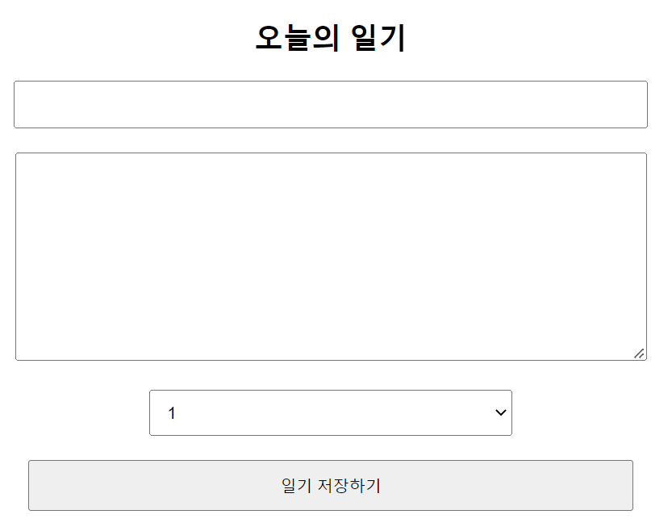

# React에서 사용자 입력 처리하기

## 프로젝트 시작 전 세팅

### React Project 생성

```bash
npx create-react-app {project 이름}
```

### 필요없는 파일 삭제

App.test.js, logo.svg, reportWebVitals.js, setupTests.js 삭제

### 파일 수정

App.js, App.css, index.js 수정(필요없는 부분 제거)

### 리액트 앱 실행

```bash
npm start
```

## 일기장 앱 만들기

### DiaryEditor component 생성

```javascript
// App.js
import './App.css';
import DiaryEditor from './DiaryEditor.js';

function App() {
  return (
    <div className="App">
      <DiaryEditor />
    </div>
  );
}

export default App;
```

```javascript
// DiaryEditor.js
const DiaryEditor = () => {
  return <div className="DiaryEditor"></div>
}

export default DiaryEditor;
```

### author와 content 값 받기

```javascript
// DiaryEditor.js
import { useState } from "react";

const DiaryEditor = () => {
  const [author, setAuthor] = useState("");
  const [content, setContent] = useState("");
  return <div className="DiaryEditor">
    <h2>오늘의 일기</h2>
    <div>
      <input value={author} onChange={(e) => {setAuthor(e.target.value)}}/>
    </div>
    <div>
      <textarea value={content} onChange={(e) => {setContent(e.target.value)}}/>
    </div>
  </div>
}

export default DiaryEditor;
```

### state를 하나로 묶기

```javascript
// DiaryEditor.js
import { useState } from "react";

const DiaryEditor = () => {
  const [state, setState] = useState({
    author:"",
    content:"",
  })
  return <div className="DiaryEditor">
    <h2>오늘의 일기</h2>
    <div>
      <input value={state.author} onChange={(e) => {setState({author:e.target.value, content:state.content})}}/>
    </div>
    <div>
      <textarea value={state.content} onChange={(e) => {setState({author:state.author, content:e.target.value})}}/>
    </div>
  </div>
}

export default DiaryEditor;
```

### spread 연산자를 통해 코드 간단히 하기

```javascript
// DiaryEditor.js
import { useState } from "react";

const DiaryEditor = () => {
  const [state, setState] = useState({
    author:"",
    content:"",
  })
  return <div className="DiaryEditor">
    <h2>오늘의 일기</h2>
    <div>
      <input value={state.author} onChange={(e) => 
          {setState({...state, author:e.target.value})}}/>
    </div>
    <div>
      <textarea value={state.content} onChange={(e) => 
          {setState({...state, content:e.target.value})}}/>
    </div>
  </div>
}

export default DiaryEditor;
```

### eventHandler 만들기

```javascript
// DiaryEditor.js
import { useState } from "react";

const DiaryEditor = () => {
  const [state, setState] = useState({
    author: "",
    content: "",
  });

  const handleChangeState = (e) => {
    setState({
      ...state,
      [e.target.name]: e.target.value,
    });
  };

  return (
    <div className="DiaryEditor">
      <h2>오늘의 일기</h2>
      <div>
        <input
          value={state.author}
          name="author"
          onChange={handleChangeState}
        />
      </div>
      <div>
        <textarea
          value={state.content}
          name="content"
          onChange={handleChangeState}
        />
      </div>
    </div>
  );
};

export default DiaryEditor;
```

### emotion 값도 받기

```javascript
// DiaryEditor.js
import { useState } from "react";

const DiaryEditor = () => {
  const [state, setState] = useState({
    author: "",
    content: "",
    emotion: 1,
  });

  const handleChangeState = (e) => {
    setState({
      ...state,
      [e.target.name]: e.target.value,
    });
  };

  return (
    <div className="DiaryEditor">
      <h2>오늘의 일기</h2>
      <div>
        <input
          value={state.author}
          name="author"
          onChange={handleChangeState}
        />
      </div>
      <div>
        <textarea
          value={state.content}
          name="content"
          onChange={handleChangeState}
        />
      </div>
      <div>
        <select
          name="emotion"
          value={state.emotion}
          onChange={handleChangeState}
        >
          <option value={1}>1</option>
          <option value={2}>2</option>
          <option value={3}>3</option>
          <option value={4}>4</option>
          <option value={5}>5</option>
        </select>
      </div>
    </div>
  );
};

export default DiaryEditor;
```

### submitHandler 만들기

```javascript
// DiaryEditor.js
import { useState } from "react";

const DiaryEditor = () => {
  const [state, setState] = useState({
    author: "",
    content: "",
    emotion: 1,
  });

  const handleChangeState = (e) => {
    setState({
      ...state,
      [e.target.name]: e.target.value,
    });
  };

  const handleSubmit = () => {
    alert(state);
  };

  return (
    <div className="DiaryEditor">
      <h2>오늘의 일기</h2>
      <div>
        <input
          value={state.author}
          name="author"
          onChange={handleChangeState}
        />
      </div>
      <div>
        <textarea
          value={state.content}
          name="content"
          onChange={handleChangeState}
        />
      </div>
      <div>
        <select
          name="emotion"
          value={state.emotion}
          onChange={handleChangeState}
        >
          <option value={1}>1</option>
          <option value={2}>2</option>
          <option value={3}>3</option>
          <option value={4}>4</option>
          <option value={5}>5</option>
        </select>
      </div>
      <div>
        <button onClick={handleSubmit}>일기 저장하기</button>
      </div>
    </div>
  );
};

export default DiaryEditor;
```

### CSS 간단하게 꾸미기

```css
.DiaryEditor {
  border: 1px solid gray;
  text-align: center;
  padding: 20px;
}

.DiaryEditor input,
textarea {
  margin-bottom: 20px;
  width: 500px;
  padding: 10px;
}

.DiaryEditor textarea {
  height: 150px;
}

.DiaryEditor select {
  width: 300px;
  padding: 10px;
  margin-bottom: 20px;
}

.DiaryEditor button {
  width: 500px;
  padding: 10px;
  cursor: pointer;
}
```


