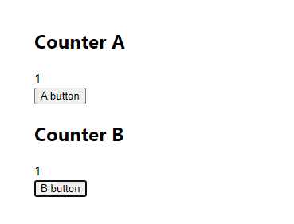

# React 최적화 - 컴포넌트 재사용. React.memo

**keyword** : `컴포넌트 재사용`, `최적화`, `React.memo`, `얕은비교`, `areEqual`


렌더링될 필요가 없는 컴포넌트가 리렌더되는 문제 발생


## React.memo

[React.memo](https://ko.reactjs.org/docs/react-api.html#reactmemo)

`React.memo`는 [고차 컴포넌트(Higher Order Component)](https://ko.reactjs.org/docs/higher-order-components.html)입니다.


컴포넌트가 **동일한 props**로 동일한 결과를 렌더링해낸다면, `React.memo`를 호출하고 결과를 메모이징(Memoizing)하도록 래핑하여 경우에 따라 성능 향상을 누릴 수 있습니다. **즉, React는 컴포넌트를 렌더링하지 않고 마지막으로 렌더링된 결과를 재사용합니다.**

`React.memo`는 props 변화에만 영향을 줍니다. `React.memo`로 감싸진 함수 컴포넌트 구현에 [`useState`](https://ko.reactjs.org/docs/hooks-state.html), [`useReducer`](https://ko.reactjs.org/docs/hooks-reference.html#usereducer) 또는 [`useContext`](https://ko.reactjs.org/docs/hooks-reference.html#usecontext) 훅을 사용한다면, 여전히 state나 context가 변할 때 다시 렌더링됩니다.

props가 갖는 복잡한 객체에 대하여 **얕은 비교만을 수행하는 것이 기본 동작입니다. 다른 비교 동작을 원한다면, 두 번째 인자로 별도의 비교 함수를 제공하면 됩니다.**

```javascript
function MyComponent(props) {
  /* props를 사용하여 렌더링 */
}
function areEqual(prevProps, nextProps) {
  /*
  nextProps가 prevProps와 동일한 값을 가지면 true를 반환하고, 그렇지 않다면 false를 반환
  */
}
export default React.memo(MyComponent, areEqual);
```


## CountView, TextView 최적화

text 값에 변화가 일어날 떄만 TextView가 리렌더되고, count값에 변화가 일어날 때만 CountView가 리렌더된다.

```javascript
import React, { useState, useEffect } from "react";

const TextView = React.memo(({ text }) => {
  console.log(`Update :: Text : ${text}`);
  return <div>{text}</div>;
});

const CountView = React.memo(({ count }) => {
  console.log(`Update :: Count : ${count}`);
  return <div>{count}</div>;
});

const OptimizeTest = () => {
  const [count, setCount] = useState(1);
  const [text, setText] = useState("");

  return (
    <div className="OptimizeTest" style={{ padding: 50 }}>
      <div>
        <h2>count</h2>
        <CountView count={count} />
        <button onClick={() => setCount(count + 1)}>+</button>
      </div>
      <div>
        <h2>text</h2>
        <TextView text={text} />
        <input value={text} onChange={(e) => setText(e.target.value)} />
      </div>
    </div>
  );
};
export default OptimizeTest;
```


## count 값 넘겼을 때, React.memo 반응의 차이





A button을 눌렀을 때는 리렌더되지 않지만, B button을 눌렀을 때는 리렌더됨. -> 같은 객체임에도 불구하고 리렌더됨.

```javascript
import React, { useState, useEffect } from "react";

const CounterA = React.memo(({ count }) => {
  useEffect(() => {
    console.log(`CounterA Update - count: ${count}`);
  });
  return <div>{count}</div>;
});

const CounterB = React.memo(({ obj }) => {
  useEffect(() => {
    console.log(`CounterB Update - count: ${obj.count}`);
  });
  return <div>{obj.count}</div>;
});

const OptimizeTest = () => {
  const [count, setCount] = useState(1);
  const [obj, setObj] = useState({ count: 1 });
  return (
    <div className="OptimizeTest" style={{ padding: 50 }}>
      <div>
        <h2>Counter A</h2>
        <CounterA count={count} />
        <button
          onClick={() => {
            setCount(count);
          }}
        >
          A button
        </button>
      </div>
      <div>
        <h2>Counter B</h2>
        <CounterB obj={obj} />
        <button onClick={() => setObj({ count: obj.count })}></button>
      </div>
    </div>
  );
};
export default OptimizeTest;
```


비원시타입의 경우, 비교시 객체의 주소에 의한 비교인 얕은 비교를 하기 때문.


## areEqual 함수 변경 후, 새로운 메모이제이션

그렇기 때문에, 객체를 props 전달하는 컴포넌트의 경우, `areEqual` 함수를 재정의할 필요가 있음.

obj.count값을 직접 비교하는 형태로 변형.

```javascript
import React, { useState, useEffect } from "react";

const CounterA = React.memo(({ count }) => {
  useEffect(() => {
    console.log(`CounterA Update - count: ${count}`);
  });
  return <div>{count}</div>;
});

const CounterB = React.memo(({ obj }) => {
  useEffect(() => {
    console.log(`CounterB Update - count: ${obj.count}`);
  });
  return <div>{obj.count}</div>;
});

const areEqual = (prevProps, nextProps) => {
  // return true; // prevProps와 nextProps 가 같다면 리렌더링을 일으키지 않음
  return prevProps.obj.count === nextProps.obj.count;
};

const MemoizedCounterB = React.memo(CounterB, areEqual);

const OptimizeTest = () => {
  const [count, setCount] = useState(1);
  const [obj, setObj] = useState({ count: 1 });
  return (
    <div className="OptimizeTest" style={{ padding: 50 }}>
      <div>
        <h2>Counter A</h2>
        <CounterA count={count} />
        <button
          onClick={() => {
            setCount(count);
          }}
        >
          A button
        </button>
      </div>
      <div>
        <h2>Counter B</h2>
        <MemoizedCounterB obj={obj} />
        <button onClick={() => setObj({ count: obj.count })}>B button</button>
      </div>
    </div>
  );
};
export default OptimizeTest;
```


