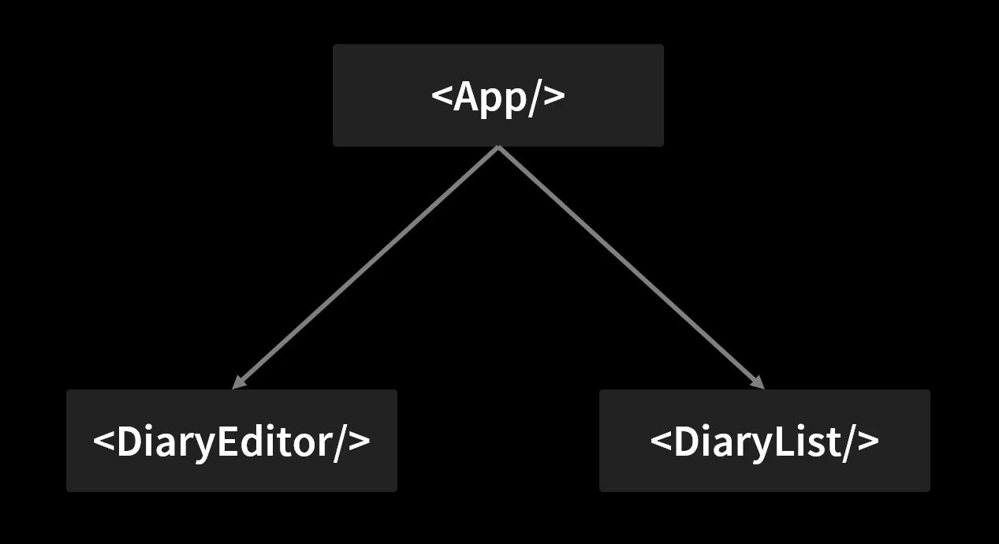
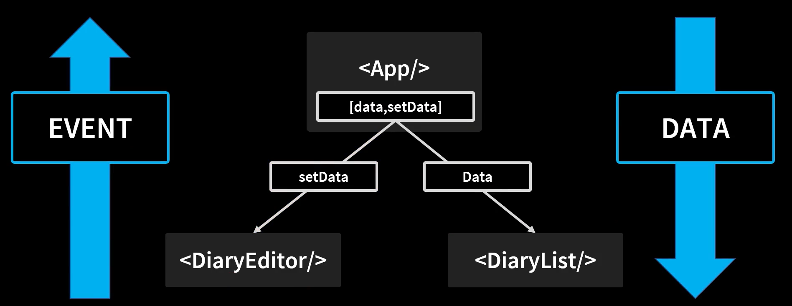

# React에서 리스트 데이터 추가하기

## 데이터 추가를 위한 state 끌어올리기

**Component tree**



DiaryEditor에서 일기 아이템을 생성해서 DiaryList에 추가해야 함.

그러나 같은 레벨의 컴포넌트끼리는 데이터를 주고 받을 수 없음.

**React는 상위 레벨에서 하위레벨로 단방향으로 데이터가 흐름** 


App.js에 State를 두어 setData를 DiaryEditor에 Data를 DiaryList에 전달.

DiaryEditor에서 새로운 일기를 작성하기 위해 setData함수를 호출.

데이터가 추가된 data가 새롭게 prop으로 DiaryList에 전달됨.



event들은 오히려 아래에서 위로 올라가는 형태로 구성.

-> **state 끌어올리기**

## 파일 수정하기

```javascript
// App.js
import { useRef, useState } from "react";
import "./App.css";
import DiaryEditor from "./DiaryEditor";
import DiaryList from "./DiaryList";

function App() {
  const [data, setData] = useState([]);
  const dataId = useRef(0);
  const onCreate = (author, content, emotion) => {
    const created_date = new Date().getTime();
    const newItem = {
      author,
      content,
      emotion,
      created_date,
      id: dataId.current,
    };
    dataId.current += 1;
    setData([newItem, ...data]);
  };
  return (
    <div className="App">
      <DiaryEditor onCreate={onCreate} />
      <DiaryList diaryList={data} />
    </div>
  );
}

export default App;
```

```javascript
// DiaryEditor.js
import { useRef, useState } from "react";

const DiaryEditor = ({ onCreate }) => {
  const authorInput = useRef();
  const contentInput = useRef();
  const [state, setState] = useState({
    author: "",
    content: "",
    emotion: 1,
  });

  const handleChangeState = (e) => {
    setState({
      ...state,
      [e.target.name]: e.target.value,
    });
  };

  const handleSubmit = () => {
    if (state.author.length < 1) {
      authorInput.current.focus();
      return;
    }
    if (state.content.length < 5) {
      contentInput.current.focus();
      return;
    }
    onCreate(state.author, state.content, state.emotion);
  };

  return (
    <div className="DiaryEditor">
      <h2>오늘의 일기</h2>
      <div>
        <input
          ref={authorInput}
          value={state.author}
          name="author"
          onChange={handleChangeState}
        />
      </div>
      <div>
        <textarea
          ref={contentInput}
          value={state.content}
          name="content"
          onChange={handleChangeState}
        />
      </div>
      <div>
        <select
          name="emotion"
          value={state.emotion}
          onChange={handleChangeState}
        >
          <option value={1}>1</option>
          <option value={2}>2</option>
          <option value={3}>3</option>
          <option value={4}>4</option>
          <option value={5}>5</option>
        </select>
      </div>
      <div>
        <button onClick={handleSubmit}>일기 저장하기</button>
      </div>
    </div>
  );
};

export default DiaryEditor;
```

## 작성 후 일기 내용 초기화

```javascript
// DiaryEditor.js
import { useRef, useState } from "react";

const DiaryEditor = ({ onCreate }) => {
  const authorInput = useRef();
  const contentInput = useRef();
  const [state, setState] = useState({
    author: "",
    content: "",
    emotion: 1,
  });

  const handleChangeState = (e) => {
    setState({
      ...state,
      [e.target.name]: e.target.value,
    });
  };

  const handleSubmit = () => {
    if (state.author.length < 1) {
      authorInput.current.focus();
      return;
    }
    if (state.content.length < 5) {
      contentInput.current.focus();
      return;
    }
    onCreate(state.author, state.content, state.emotion);
    setState({
      author: "",
      content: "",
      emotion: 1,
    });
  };

  return (
    <div className="DiaryEditor">
      <h2>오늘의 일기</h2>
      <div>
        <input
          ref={authorInput}
          value={state.author}
          name="author"
          onChange={handleChangeState}
        />
      </div>
      <div>
        <textarea
          ref={contentInput}
          value={state.content}
          name="content"
          onChange={handleChangeState}
        />
      </div>
      <div>
        <select
          name="emotion"
          value={state.emotion}
          onChange={handleChangeState}
        >
          <option value={1}>1</option>
          <option value={2}>2</option>
          <option value={3}>3</option>
          <option value={4}>4</option>
          <option value={5}>5</option>
        </select>
      </div>
      <div>
        <button onClick={handleSubmit}>일기 저장하기</button>
      </div>
    </div>
  );
};

export default DiaryEditor;
```
