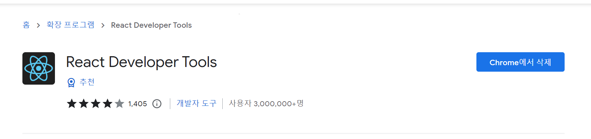
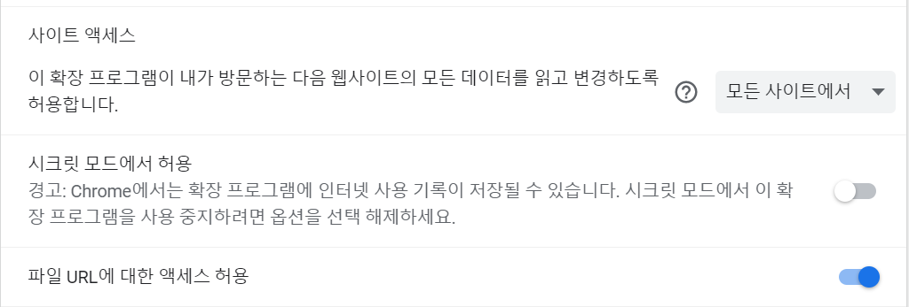
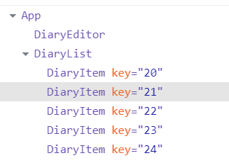
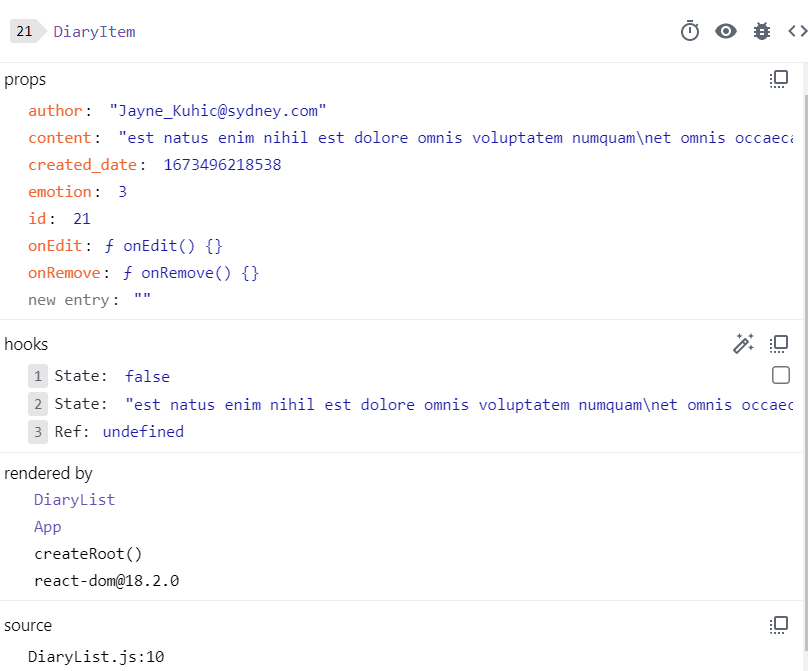
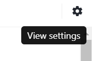
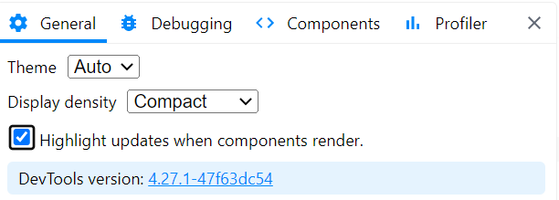
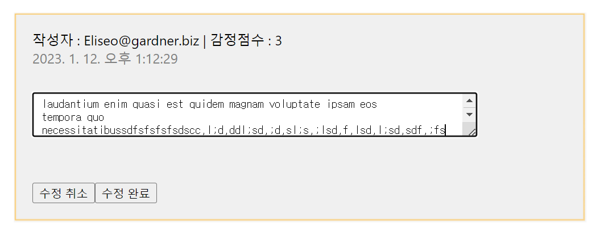

# React Developer Tools

리액트 개발을 돕는 크롬 확장 프로그램.

## 설치

## 설정 변경

도구 더보기 -> 확장 프로그램 -> React Developer Tools

로 설정 변경

## 사용법

개발자 도구(F12)에서 `>>` 버튼을 누르면 `Components` Tab과 `Profiler` Tab이 생성된 것을 확인할 수 있음.

### 구조

컴포넌트의 계층구조와 각 컴포넌트의 props값, hooks 등 어떤 데이터와 상태로 이루어져 있는지 확인할 수 있음.

 

view settings -> highlight updates when components render 체크

컴포넌트가 리렌더되고 있는 부분을 보여줌.

