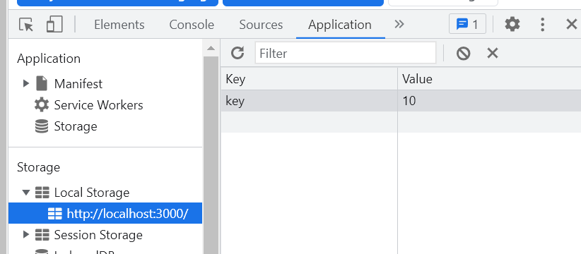
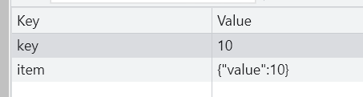

# LocalStorage 사용하기

  

새로고침을 눌렀을 때 이전에 생성해두었던 글들이 사라지는 문제가 발생한다. 보통은 데이텨베이스에 데이터를 저장하고 그 데이터를 불러오는 방식을 사용한다. 대신 `Web Storage API`의 `localStorage`를 활용하여 데이터를 로컬에 저장하는 방식을 택했다.


## localStorage 사용 방법

#### 데이터 저장하기

```javascript
localStorage.setItem("key", 10);
// key는 "key"로 value는 "10"으로 localStorage에 값을 저장하겠다는 의미

```

   

객체를 저장할 때는 그냥 저장할 경우 value에 [object Object] 형태로 저장되기 때문에 직렬화를 해준 다음 저장한다.

```javascript
localStorage.setItem("item", JSON.stringify({ value: 10 }));
```

 

#### 데이터 불러오기

```javascript
const item = localStorage.getItem("item");
```

모든 값들은 문자열 형태로 바뀌기 때문에 이에 유의해야 한다.


localStorage를 적용시켜 diaryList를 관리해보자.

localStorage에 저장되어 있던 diary 데이터를 JSON.parse로 다시 리스트로 만든 다음, dataId 값을 구하기 위해 정렬한다. 가장 높은 id 값에 +1을 하여 새로운 id 값으로 지정하고 모든 data를 dispatch를 통해 data에 적용시킨다.

```javascript
const dataId = useRef(0);

useEffect(() => {
  const localData = localStorage.getItem("diary");
  if (localData) {
    const diaryList = JSON.parse(localData).sort(
      (a, b) => parseInt(b.id) - parseInt(a.id)
    );
    dataId.current = parseInt(diaryList[0].id) + 1;
    dispatch({
      type: "INIT",
      data: diaryList,
    });
  }
}, []);
```
