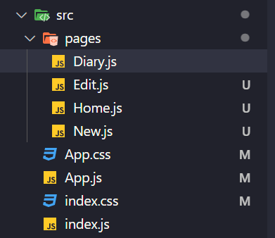

# 페이지 라우팅 1 - React Router 기본

**keyword**: `Router`, `React Router`, `react-router-dom`, `BrowswerRouter`, `Link`

## React-router

### Installation

```bash
$ npm install react-router-dom@6
```

@6이 붙은이유는 6.x.x버전을 설치하겠다는 의미.

### Project 실행

```bash
$ npm start
```

### pages 폴더 만들어서 구분



`src` 하위에 `pages`라는 폴더를 생성하고, `Diary.js`, `Edit.js`, `Home.js`, `New.js` 파일을 생성.

```javascript
// Home.js
const Home = () => {
  return (
    <div>
      <h1>Home</h1>
      <p>이곳은 Home 입니다.</p>
    </div>
  );
};

export default Home;
```

```javascript
// New.js
const New = () => {
  return (
    <div>
      <h1>New</h1>
      <p>이곳은 일기 작성 페이지입니다.</p>
    </div>
  );
};

export default New;
```

```javascript
// Edit.js
const Edit = () => {
  return (
    <div>
      <h1>Edit</h1>
      <p>이곳은 일기 수정 페이지입니다.</p>
    </div>
  );
};

export default Edit;
```

```javascript
// Diary.js
const Diary = () => {
  return (
    <div>
      <h1>Diary</h1>
      <p>이곳은 일기 상세 페이지입니다.</p>
    </div>
  );
};

export default Diary;
```

### router 연결하기

`react-router-dom`으로 부터 `BrowswerRouter`, `Route`, `Routes`를 import 한다.

이후, 모든 컴포넌트를 `BrowserRouter` 컴포넌트로 감싼다.

내부에 `Routes` 컴포넌트를 만들고 그 하위에 `Route` 컴포넌트를 만든다.

`Route` 컴포넌트의 `path` 값에는 접속할 경로를 작성해주고, `element` 값에는 렌더링될 컴포넌트를 넣어준다.

```javascript
import "./App.css";
import { BrowserRouter, Route, Routes } from "react-router-dom";
import Home from "./pages/Home";
import Edit from "./pages/Edit";
import New from "./pages/New";
import Diary from "./pages/Diary";

function App() {
  return (
    <BrowserRouter>
      <div className="App">
        <h2>App.js</h2>
        <Routes>
          <Route path="/" element={<Home />} />
          <Route path="/new" element={<New />} />
          <Route path="/edit" element={<Edit />} />
          <Route path="/diary" element={<Diary />} />
        </Routes>
      </div>
    </BrowserRouter>
  );
}

export default App;
```

### Page 이동 구현

`<a>` 태그를 사용할 경우, 새로고침이 일어나기 때문에 다른 방식을 사용해야 함. -> MPA 방식대신 SPA 방식. 대신 `<LINK>` 태그를 이용하여 구현한다.

먼저 컴포넌트들을 저장할 `components` 폴더를 `src`에 만들어 준다.

`components` 폴더 안에 Route 이동을 테스트할 `RouteTest.js` 파일을 만들어 준다.

page 이동을 구현하기 위해,

먼저, `react-router-dom`으로 부터 `Link`를 import한다.

그 후, `<Link>` 태그를 사용하여 `to`에는 우리가 이동할 경로를 작성해주고, 그 링크 누를 수 있도록 태그 내부에 문자(`HOME`, `DIARY`, ...)를 넣어준다.

```javascript
// components/RouteTest.js
import { Link } from "react-router-dom";
const RouteTest = () => {
  return (
    <>
      <Link to={"/"}>HOME</Link>
      <br />
      <Link to={"/diary"}>DIARY</Link>
      <br />
      <Link to={"/new"}>NEW</Link>
      <br />
      <Link to={"/edit"}>EDIT</Link>
    </>
  );
};

export default RouteTest;
```

이 컴포넌트는 일종의 navigation bar와 같은 역할을 한다.

이 컴포넌트를 `App` 컴포넌트에서 불러들여 어떤 컴포넌트로 이동하든지, 클릭할 수 있도록 한다.

```javascript
import "./App.css";
import { BrowserRouter, Route, Routes } from "react-router-dom";
import Home from "./pages/Home";
import Edit from "./pages/Edit";
import New from "./pages/New";
import Diary from "./pages/Diary";
import RouteTest from "./components/RouteTest";

function App() {
  return (
    <BrowserRouter>
      <div className="App">
        <h2>App.js</h2>
        <Routes>
          <Route path="/" element={<Home />} />
          <Route path="/new" element={<New />} />
          <Route path="/edit" element={<Edit />} />
          <Route path="/diary" element={<Diary />} />
        </Routes>
        <RouteTest />
      </div>
    </BrowserRouter>
  );
}

export default App;
```
