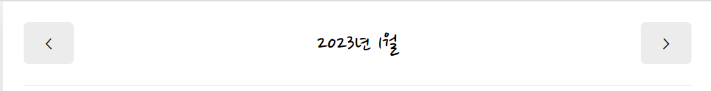
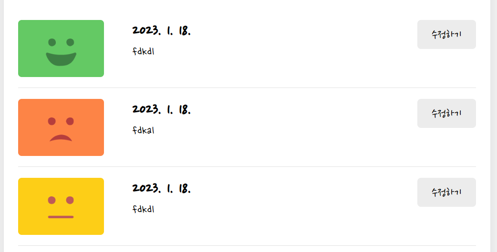
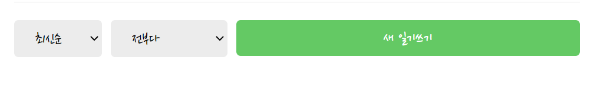
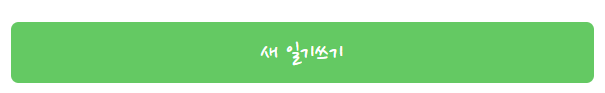

# Home 구현하기

**keyword**: 


## Header 만들기

이미 구현되어 있는  `MyHeader` 컴포넌트를 활용해 만들 예정이다.



가운데에는 `-년 -월`을 넣어줄 것이고 왼쪽과 오른쪽에는 월을 감소, 증가시키는 버튼을 추가할 것이다. `-년-월`은 계속 변화하는 데이터이기 때문에 `curDate`로 만들어 상태관리를 해주어야 한다. 

1. 먼저, 오늘 날짜인 `curDate` 를 state로 만든다.

`-년-월`은 계속 변화하는 데이터이기 때문에 `curDate`로 만들어 상태관리를 해주어야 한다. `curDate`는 해당 날짜 값을 의미하고 이러한 값을 `setCurDate`를 통해 바꿔준다. 초기값은 오늘 날짜로 설정한다.  

```javascript
// App.js
const [curDate, setCurDate] = useState(new Date());
```

2. 오늘 날짜를 이용해 `headText`의 값을 설정한다.

`Date` 객체의 년도와 월을 받아오기 위해 `getFullYear`, `getMonth` 함수를 이용하면 된다. 한가지 주의할 점은, `getMonth`는 0부터 시작이기 때문에 +1을 해주어야 한다. 

```javascript
// App.js
const headText = `${curDate.getFullYear()}년 ${curDate.getMonth() + 1}월`;
```

3. 월을 증가, 감소 시킬 버튼의 기능을 구현하기 위해, increaseMonth, decreaseMonth 함수를 구현한다.

 `setCurDate`를 이용하여 월 증가, 감소시킨 값을 `curDate`에 적용시킴으로써, 새롭게 렌더링될 수 있도록 하였다.  

```javascript
const increaseMonth = () => {
  setCurDate(
    new Date(curDate.getFullYear(), curDate.getMonth() + 1, curDate.getDate())
  );
};
// 월 감소
const decreaseMonth = () => {
  setCurDate(
    new Date(curDate.getFullYear(), curDate.getMonth() - 1, curDate.getDate())
  );
};
```

4. 이를 `MyHeader` 컴포넌트에 적용시킨다.

```javascript
// App.js
<MyHeader
  headText={headText}
  leftChild={<MyButton text={"<"} onClick={() => decreaseMonth()} />}
  rightChild={<MyButton text={">"} onClick={() => increaseMonth()} />}
/>
```


## DiaryList 받아서 보여주기

새롭게 `DiaryList`를 만들어서 `Home` 컴포넌트에 추가해보자.

구현할 `DairyList`는 다음과 같이 생겼다.



1. 먼저, `DiaryList` 컴포넌트를 만든다.
   
   혹시나 빈 객체가 들어올 수 있기 때문에, `defaultProps`를 `[]`로 설정해둔다.
   
   ```javascript
   // DiaryList.js
   const DiaryList = ({ diaryList }) => {
       return <div className="DiaryList"></div>
   }
   DiaryList.defaultProps = {
     diaryList: [],
   };
   
   export default DiaryList;
   ```

2. 더미 데이터를 만들어서 `context`로 관리할 수 있게 처리하고, 해당 데이터를 `Home`으로 받아온다.
   
   날짜를 `Home` 컴포넌트에서 처리하기 때문에, `DiaryList`가 아닌 `Home` 컴포넌트로 받고 이 데이터를 `DiaryList`로 넘겨준다.
   
   ```javascript
   // App.js
   const dummyData = [
     { id: 1, content: "fdkasdl", date: 1674029801991, emotion: 5 },
     { id: 2, content: "fdkas", date: 1674029801992, emotion: 2 },
     { id: 3, content: "fdkdl", date: 1674029801993, emotion: 3 },
     { id: 4, content: "fdkal", date: 1674029801994, emotion: 4 },
     { id: 5, content: "fdkdl", date: 1674029801995, emotion: 1 },
   ];
   
   const App = () => {
       const [data, dispatch] = useReducer(reducer, dummyData);
       ...    
   }
   ```
   
   ```javascript
   // Home.js
   import { DiaryStateContext } from "../App";
   const diaryList = useContext(DiaryStateContext);
   ```

3. 현재 `-년 -월`에 맞는 데이터를 뽑아낸다. 
   처리한 데이터를 따로 상태관리 해주기 위해 `data` 로 따로 저장하여 넘겨주는 방법을 사용했다. 현재 월의 제일 첫날과 제일 마지막날의 사이의 시간인 일기 데이터만 필터링하여 이를 `setData`를 통해 `data` 값으로 저장한다. 이는 `diaryList`와 `curDate` 값이 변할 때 적용될 수 있도록 `useEffect`를 사용하였다. 이를 통해, 새로운 일기가 추가, 기존의 일기가 삭제 및 수정되는 이벤트와, 현재의 시간을 변경하는 이벤트 모두에 반응할 수 있도록 한 것이다.  이렇게 필터링된 데이터를 `DiaryList` 컴포넌트에 전달한다.
   
   ```javascript
   // Home.js
   const [data, setData] = useState([]);
   useEffect(() => {
       if (diaryList.length >= 1) {
         const firstDay = new Date(
           curDate.getFullYear(),
           curDate.getMonth(),
           1
         ).getTime();
         const lastDay = new Date(
           curDate.getFullYear(),
           curDate.getMonth() + 1,
           0
         ).getTime();
         setData(
           diaryList.filter((it) => firstDay <= it.date && it.date <= lastDay)
         );
       }
     }, [diaryList, curDate]);
   ```
   
   ```javascript
   // DiaryList.js
   <DiaryList diaryList={data} />
   ```


## 정렬, 필터 기능 추가하기



### 정렬 기능 구현하기

1. 현재 `diaryList` 데이터를 처리하기 위한 `ControlMenu` 컴포넌트를 생성한다.
   
   `props`로는 현재 선택하고 있는 값인 `value`, 다른 값을 선택했을 때 value르 바꾸기 위한 `onChange`, 선택지들이 저장된 `optionList`를 받는다. 만약 선택된 값이 변경됐을 경우 `onChange`에 변경된 값을 인자로 전달한다.
   
   ```javascript
   const ControlMenu = ({ value, onChange, optionList }) => {
     return (
       <select
         className="ControlMenu"
         value={value}
         onChange={(e) => onChange(e.target.value)}
       >
         {optionList.map((it, idx) => (
           <option key={idx} value={it.value}>
             {it.name}
           </option>
         ))}
       </select>
     );
   };
   ```

2. `ControlMenu` 에 넘길 데이터를 정리한다. (`value`, `onChange`, `optionList`)
   
   먼저, 어떤 방식으로 정렬할 것인지 `optionList`를 만든다.
   
   ```javascript
   // DiaryList.js
   const sortOptionList = [
     { value: "latest", name: "최신순" },
     { value: "oldest", name: "오래된순" },
   ];
   ```
   
   현재의 선택된 값을 상태 관리하기 위해 `sortType`이라는 state로 만든다. 초기값은 `latest`로 설정한다. 
   
   ```javascript
   const [sortType, setSortType] = useState("latest");
   ```
   
   `setSortType`을 통해 값이 변할 때 마다 `sortType`에 적용시킬 수 있도록 `onChange` 값으로 넣어준다.
   
   ```javascript
   <ControlMenu
     value={sortType}
     onChange={setSortType}
     optionList={sortOptionList}
   />
   ```

3. 선택된 `정렬` 값에 따라 데이터가 정렬한 후, 이를 새로운 데이터로 만들어 값을 저장한다.
   
   먼저, diaryList 값에는 어떠한 변화도 주지 않도록 하기 위해, diaryList 값을 복사해야한다. 깊은 복사를 하는 방법도 있지만, 더 간단한 방법은, `JSON.stringify`를 통해 문자열로 바꾼 뒤, 이 문자열을 다시 `JSON.parse`를 통해 리스트로 만들어 주는 것이다.  
   
   ```javascript
    const copyList = JSON.parse(JSON.stringify(diaryList));
   ```
   
   그 다음, 저장된 글들의 순서를 정렬할 것인데, 객체 내 날짜를 기준으로 정렬을 해야하기 때문에 `compare` 함수를 따로 만든다. `sortType`에 따라 순서를 달리하는데, a가 먼저 오게하기 위해서는 반환값으로 음수를 return 해야하고 b가 먼저오게 하기 위해서는 반환값으로 양수를 return 해야한다. `date`의 값이 숫자라는 보장을 할 수 없기 때문에, `parseInt`를 통해 숫자값으로 바꿔주어야 한다.
   
   ```javascript
   const compare = (a, b) => {
     if (sortType === "latest") {
       return parseInt(b.date) - parseInt(a.date);
     } else {
       return parseInt(a.date) - parseInt(b.date);
     }
   };
   ```
   
   이렇게 만든 compare 함수를 sort함수에 인자로 넣어 정렬해주고 정렬된 리스트를 받을 수 있게 하였다.
   
   ```javascript
   const getProcessedDiaryList = () => {
     const compare = (a, b) => {
       if (sortType === "latest") {
         return parseInt(b.date) - parseInt(a.date);
       } else {
         return parseInt(a.date) - parseInt(b.date);
       }
     };
     const copyList = JSON.parse(JSON.stringify(diaryList));
   
     const sortedList = copyList.sort(compare);
     return sortedList;
   };
   ```

### 필터 기능 구현하기

정렬 기능과 유사하게 구현하면 된다.

1. `ControlMenu`에 넘길 데이터를 정리한다. (`value`, `onChange`, `optionList`)
   
   먼저, 어떤 방식으로 필터링할 것인지 `filterOptionList`를 만든다.
   
   ```javascript
   const filterOptionList = [
     { value: "all", name: "전부다" },
     { value: "good", name: "좋은 감정만" },
     { value: "bad", name: "안좋은 감정만"}
   ];
   ```
   
   현재의 선택된 값을 상태 관리하기 위해 `filter`이라는 state로 만든다. 초기값은 `all`로 설정한다.
   
   ```javascript
   const [filter, setFilter] = useState("all");
   ```
   
   `setFilter`을 통해 값이 변할 때 마다 `filter`에 적용시킬 수 있도록 `onChange` 값으로 넣어준다.
   
   ```javascript
   <ControlMenu
     value={filter}
     onChange={setFilter}
     optionList={filterOptionList}
   />
   ```

2. 선택된 `필터` 값에 따라 데이터를 필터링한 후, 이를 새로운 데이터로 만들어 값을 저장한다.
   
   이전에 만들어 두었던 `getProcessedDiaryList`에서 `copyList`를 받아 정렬 전, 먼저 필터링을 해준다. 필터링을 위해 `filterCallback` 함수를 만들어서 `filter`의 값에 따라 emotion의 값이 특정 조건을 만족하는지 여부를 return 할 수 있도록 한다. 이를 필터함수에 적용시키고 이렇게 만들어진 리스트를 정렬하여 return할 수 있도록 한다.
   
   ```javascript
   const getProcessedDiaryList = () => {
     const filterCallBack = (item) => {
       if (filter === "good") {
         return parseInt(item.emotion) <= 3;
       } else {
         return parseInt(item.emotion) > 3;
       }
     };
     ...
     const copyList = JSON.parse(JSON.stringify(diaryList));
   
     const filteredList =
       filter === "all" ? copyList : copyList.filter((it) => filterCallBack(it));
     const sortedList = filteredList.sort(compare);
     return sortedList;
   };
   ```

3. 구현된 diaryList를 diaryItem에 넣어주기
   
   ```javascript
   {getProcessedDiaryList().map((it) => (
     <DiaryItem key={it.id} {...it} />
   ))}
   ```

## 새 일기 쓰기 버튼 추가하기



이전에 만들어두었던 `MyButton`을 활용하면 된다. 클릭했을 경우 `/new` 라는 경로로 이동해야하기 때문에 `useNavigate`를 활용하여 구현한다.

```javascript

import { useNavigate } from "react-router-dom";


const App = () => {
    const navigate = useNavigate();
    return 
    ...
    <div className="right_col">
      <MyButton
        type={"positive"}
        text={"새 일기쓰기"}
        onClick={() => navigate("/new")}
    />
    </div>
    ...
}

```


#### 공부를 하며 느꼈던 점 & 계속 개발을 하면서 고려해야 할 점..

- 데이터를 처리함에 있어 **순서가 굉장히 중요**하다.
  
  - 날짜에 따라 데이터를 먼저 처리하고, 필터링을 거친 뒤,정렬을 한다...

- 숫자로 계산하기 위해서 **parseInt**를 잊지말자.

- **filter, sort 함수**를 사용할 때, 원하는 기준이 따로 있다면 직접 구현해보자.
  
  - **return 값 설정을 좀 더 간결**하게 만드는 것에 익숙해지기..

- **삼항연산자**를 적절히 사용하면 코드가 훨씬 간결해진다..! 

- **defaultProps** 를 잊지말자.
  
  - 언제나 데이터가 잘 들어오지 않을 수도 있기 때문에 그 상황을 놓치지 말자!


