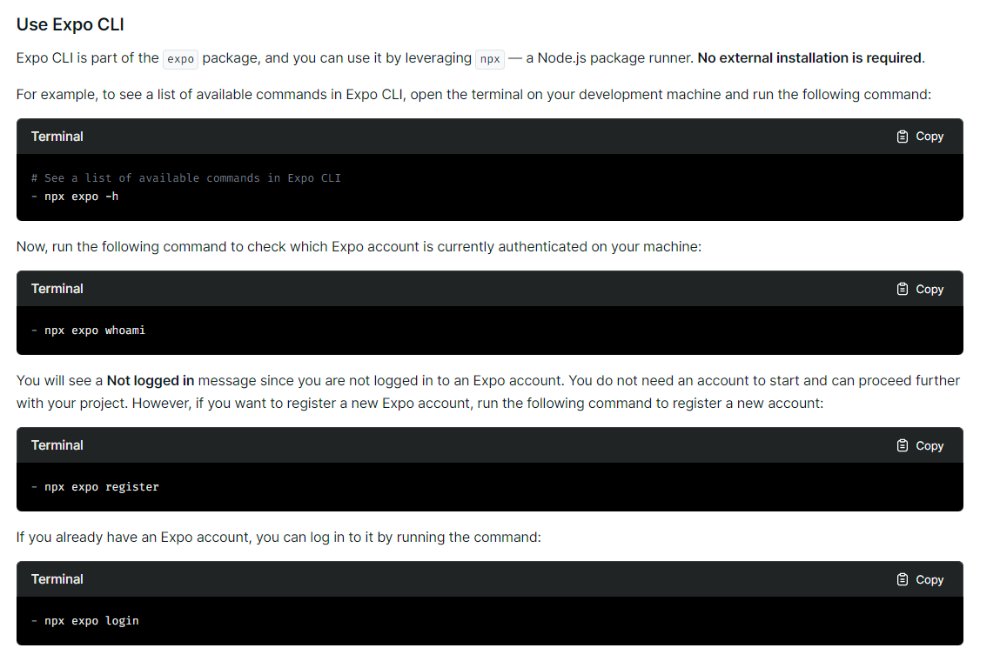
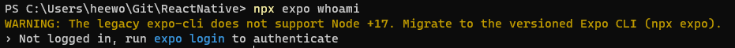
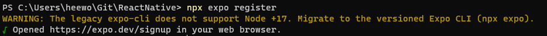
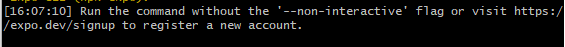
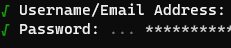
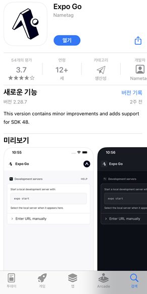

# 1.4 Installing Requirements

니콜라스의 expo 버전과 현재 expo 버전이 달라 실제로는 설치가 필요없었다. 자세한 내용은 공식 홈페이지 [expo-doc](https://docs.expo.dev/home/get-started/installation/#expo-cli)에서 확인할 수 있다.

## npx expo

### 설치

실제 강좌에서는 `npm install --global expo-cli`를 사용하라 했지만,

현재는 ❗**설치를 하지 않고** ❗`npx`를 활용해 진행한다.(No external installation is required)





### 로그인 여부 확인

먼저 현재 로그인이 되어있는지 여부를 확인한다. 

```bash
$ npx expo whoami
```

로그인이 되어있지 않다면 다음과 같이 나올 것이다.




### 등록

먼저 expo를 사용하기 위해 등록부터 진행한다

```bash
$ npx expo register 
```



회원가입을 하기 위한 창이 열리며 회원가입을 할 수 있도록 유도된다.

브라우저에 로그인해도 cli 환경에서는 로그인이 되지 않는다. 주의하자

> ❗git bash에서 할 때는 다음과 같이 `--non-interactive` 와 관련된 에러가 발생했다. 그래서 그냥 powershell로 옮겨서 진행했다.
>
> 


### 로그인

expo에 로그인해보자.

```bash
$ npx expo login
```




### 유저 확인

그러면 다시 처음에 했던 유저 확인을 다시 해보자. 그러면 현재 로그인된 계정이 보일 것이다.

```bash
$ npx expo whoami
```


## Expo Go 설치

핸드폰이 아이폰이라 App Store에 들어가 `Expo Go`를 설치해주었다.



안드로이드에서는 `Expo` 앱을 다운받으면 된다. 해당 앱에서 아까 만들었던 계정으로 로그인 하면 된다.