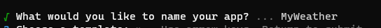
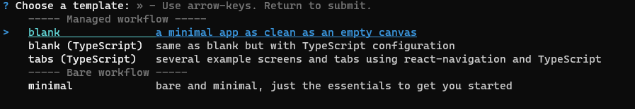
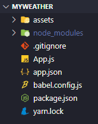
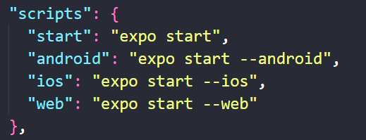

# 1.6 Creating The App

## 템플릿 설치

새로운 앱을 만들기 위해 환경을 초기화 해보자. 

```bash
$ npx expo init
```

위의 명령어를 입력하면 다음과 같이 진행된다.

### App 이름 입력하기

만들고자 하는 App의 이름을 입력한다.

강의에서는 NomadWeather로 입력했지만, 나는 MyWeather로 입력했다.



### 템플릿 선택

템플릿을 선택한다.

TypeScript를 쓰지 않기 때문에 그냥 blank를 선택한 것 같다.



설치하는데 시간이 조금 걸리기 때문에 기다려 준다.

### 설치 완료

설치가 완료되면 다음과 같은 폴더 구조가 만들어진다.




## 애플리케이션 실행

방금 초기화된 애플리케이션을 `Expo Go` 앱에서 실행시켜보자.

실행 시키기 전 먼저 `package.json` 파일을 확인해서 명령어를 확인해보자.



위와 같이 나와 있는데, 앱을 실행시키기 위해 다음 명령어를 입력한다.

```bash
$ npm start
```

Expo Go 앱에서 로그인이 되어있는 상태라면, 만든 프로젝트에 바로 들어갈 수 있을 것이다. 그래서 들어가보면 다음과 같은 화면이 보인다.


