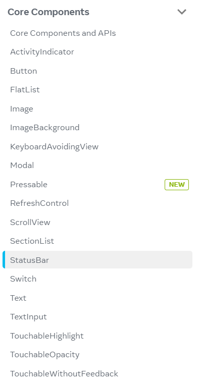
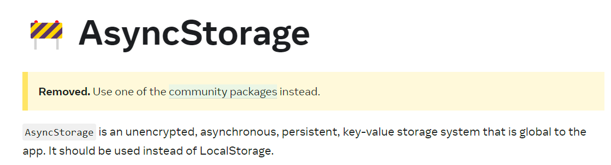
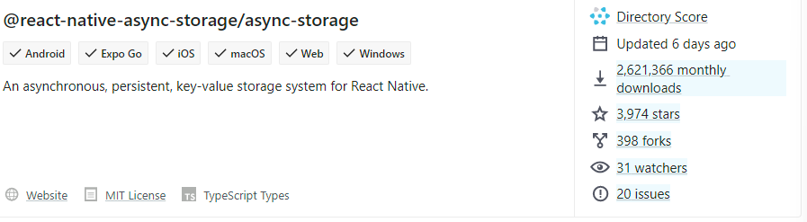
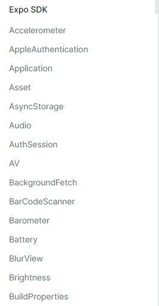

# React Native Packages & Third Party Packages

[React Native](https://reactnative.dev/)의 Document에 들어가면 RN가 제공하는 컴포넌트들을 확인해볼 수 있다.



한 가지 흥미로운 점은, 이전 시간에 다뤘던 StatusBar도 RN가 제공하고 있다는 사실이다. (이 내용은 조금 아래에서 다루겠다.)

과거에는 지금보다 더 많은 Core Components(`AsyncStorage`, `Navigator`)와 같은 컴포넌트들이 존재했었다. 그러나 현재는 `Deprecated` 되었다. 



RN는 처음에는 개발자들에게 최대한 많은 API와 Component들을 제공하려 했지만, 모든 컴포넌트를 유지 관리하고 업데이트하기 어려웠기 때문에 규모를 줄인 것이다.


> ⭐**Component와 API의 차이**
>
> **Component**는 화면에 렌더링할 항목을 의미한다. ex) `View`, `StatusBar`
>
> **API**는 운영체제와 소통하기 위한 자바스크립트 코드이다. ex) `Vibration`


❓그러면 사라진 `AsyncStorage` 대신 어떤 패키지를 사용할 수 있을까❓

우리는 **3rd-party**인 [community packages](https://reactnative.directory/?search=storage)들을 사용할 수 있다! 이런 패키지들은 RN 에서 직접 버그를 수정하지 않고 community, 즉 RN를 사용하는 일반 사용자들이 수정한다. 

어떤 패키지를 사용하는게 좋은지 어떻게 판단하는 것이 좋을까?



업데이트가 빈번하게 이루어지고, 사용자가 많을수록 좋다! 


[Expo](https://docs.expo.dev/versions/latest/)에서도 여러 패키지들을 제공한다.



```javascript
import { StatusBar } from "expo-status-bar";
import { StyleSheet, Text, View } from "react-native";
```

이전 코드에서 RN의 statusbar가 아닌 Expo의 StatusBar 사용된 것을 볼 수 있다. Expo가 RN의 일부 컴포넌트와 API를 복제(clone)하고 개선하기로 결정했기 때문이다. 실제로 기능은 거의 유사하지만 조금 차이가 있다. (function 이름 등)

Expo에서는 RN이 제공하지 않는 기능들도 많이 제공하고 있다. 