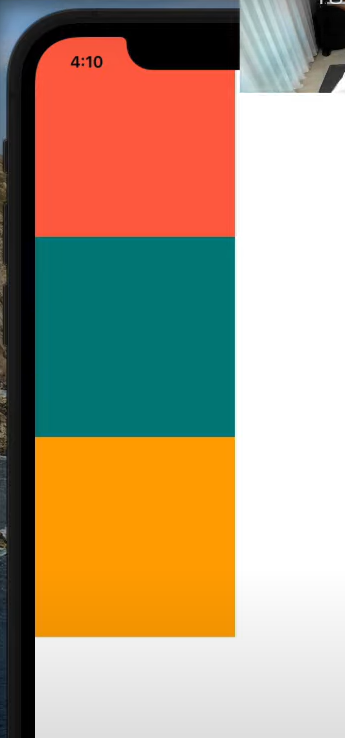
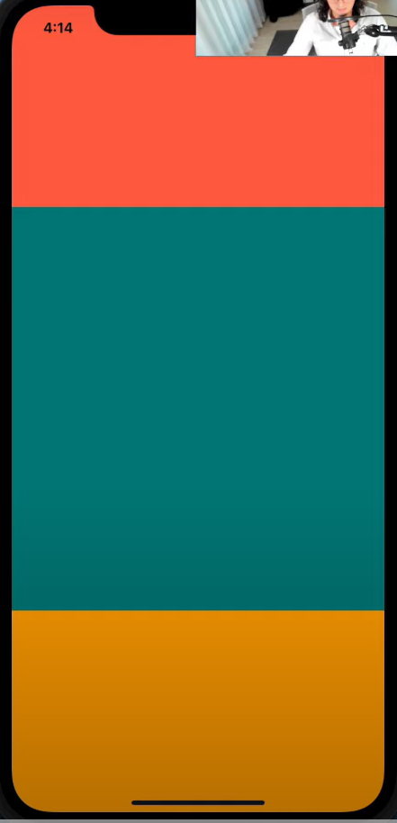

# Layout System

RN에서의 `Layout`은 `Flexbox`를 이용해 만들어진다.


`View`의 `Flexbox`와 관련된 몇 가지 특성을 알아보자. 다음과 같은 예시 코드를 작성해보자. 

```react
<View>
  <View
    style={{ width: 100, height: 100, backgroundColor: "tomato" }}
  ></View>
  <View style={{ width: 100, height: 100, backgroundColor: "teal" }}></View>
  <View
    style={{ width: 100, height: 100, backgroundColor: "orange" }}
  ></View>
</View>
```

1. `View` 는 원래 `Flex Container`이다. 그래서 따로 flex라고 지정해 줄 필요가 없다.

2. `Flex Direction`의 기본값은 `Column`이다. 

   

3. 스크린의 사이즈는 기기마다 다르기 때문에 `width`, `height`를 사용하는 것보다는 flex와 관련된 size를 명시하는 것이 좋다.

   ```react
   <View style={{ flex: 1 }}>
     <View style={{ flex: 3, backgroundColor: "tomato" }}></View>
     <View style={{ flex: 2, backgroundColor: "teal" }}></View>
     <View style={{ flex: 1, backgroundColor: "orange" }}></View>
   </View>
   ```

   1. 먼저 부모 컨테이너 속성에 `flex: 1`이라는 스타일을 적용한다.

   2. 각각의 자식 컨테이너가 차지할 비율을 기반으로 자식 컨테이너 속성에  `flex: 비율`을 넣는다.

      ex) `flex: 1.5`, `flex: 3` 

      

      

