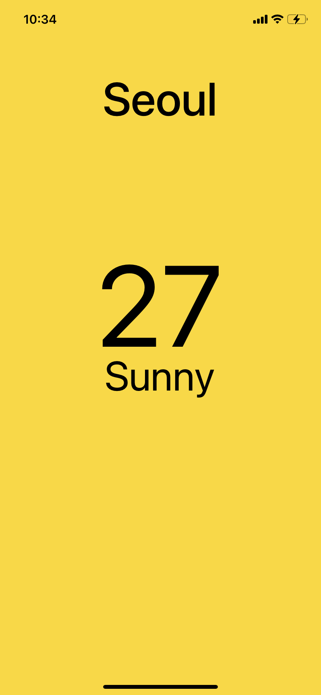

# 2.5 Styles

기본적인 틀을 만들고 스타일을 적용시켜 보자.

```react
import { StatusBar } from "expo-status-bar";
import React from "react";
import { View, Text, StyleSheet } from "react-native";

export default function App() {
  return (
    <View style={styles.container}>
      <View style={styles.city}>
        <Text style={styles.cityName}>Seoul</Text>
      </View>
      <View style={styles.weather}>
        <View style={styles.day}>
          <Text style={styles.temp}>27</Text>
          <Text style={styles.description}>Sunny</Text>
        </View>
      </View>
    </View>
  );
}

const styles = StyleSheet.create({
  container: {
    flex: 1,
    backgroundColor: "gold",
  },
  city: {
    flex: 1.2,
    justifyContent: "center",
    alignItems: "center",
  },
  cityName: {
    fontSize: 68,
    fontWeight: "500",
  },
  weather: {
    flex: 3,
  },
  day: {
    flex: 1,
    alignItems: "center",
  },
  temp: {
    marginTop: 50,
    fontSize: 168,
  },
  description: {
    marginTop: -30,
    fontSize: 60,
  },
});
```


