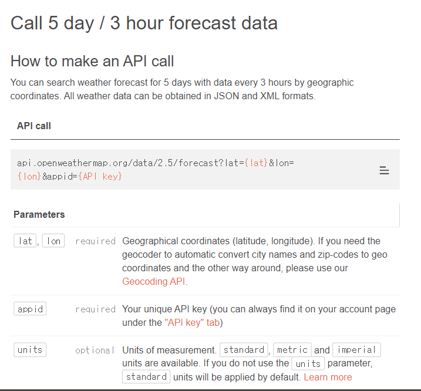

# 2.8 Weather

[open weather API](https://openweathermap.org/forecast5)를 활용해서 5일 간의 날씨를 받아와보자. (다른 API가 안돼서 `5 day weather forecast`로 진행하였다.)




먼저 API_KEY를 발급받는다. (일정 시간이 지나야 사용 가능하다.)

그 후, 발급받은 API_KEY를 가지고 `fetch`를 이용해 요청을 날릴 것이다.

```react
const response = await fetch(
      `https://api.openweathermap.org/data/2.5/forecast?lat=${latitude}&lon=${longitude}&appid=${API_KEY}&units=metric`
    );
const json = await response.json();	
```

`latitude`, `longitude`는 이전 수업 때 받았던 내용을 참고하면 될 것이다. 섭씨로 받아오기 위해 `units=metric`을 추가하였다.

이렇게 받아진 `json`을 보면 **3시간 단위**로 받아오는 것을 확인할 수 있다. 하루 간격으로 받아오기 위해 인덱스가 8로 나눴을 때 나머지가 0일 때만 가져올 수 있도록 필터링한다. 그리고 해당 데이터를 `days`로 저장한다.

```react
const data = json.list.filter((d, i) => i % 8 == 0);
setDays(data);
```


이렇게 받아온 데이터를 가지고 온도와 날씨 정보를 가져올 것이다. 그 전에, 날씨 데이터가 아직 받아오기 이전에 로딩 중이라는 표시를 [activity indicator](https://reactnative.dev/docs/activityindicator) 컴포넌트를 활용해 표현할 수 있다.

```react
 {days.length === 0 ? (
    <View style={styles.day}>
      <ActivityIndicator
        color="white"
        size="large"
        style={{ marginTop: 10 }}
      />
    </View>
  ) : (
    days.map((d, i) => (
      <View key={i} style={styles.day}>
        <Text style={styles.temp}>
          {parseFloat(d.main.temp).toFixed(1)}
        </Text>
        <Text style={styles.description}>{d.weather[0].main}</Text>
        <Text style={styles.tinyDescription}>
          {d.weather[0].description}
        </Text>
      </View>
    ))
  )}
```

그 후 데이터를 확인해보면, `weather[0].main`에 날씨가, `d.main.temp`에 온도 정보가 담겨 있기 때문에 해당 정보를 받아온다. 온도를 소수 두번째 자리에서 반올림하기 위해 `parseFloat(d.main.temp).toFixed(1)`로 작성해주면 된다.

