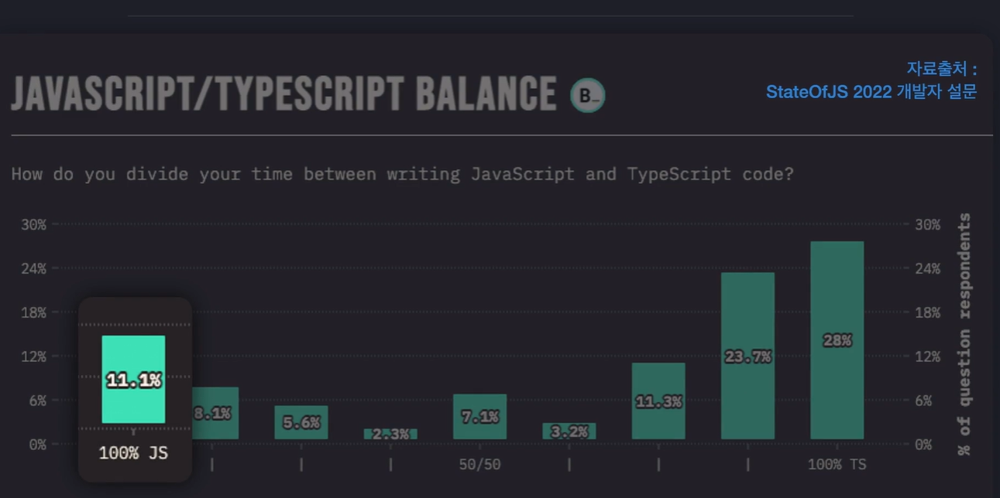
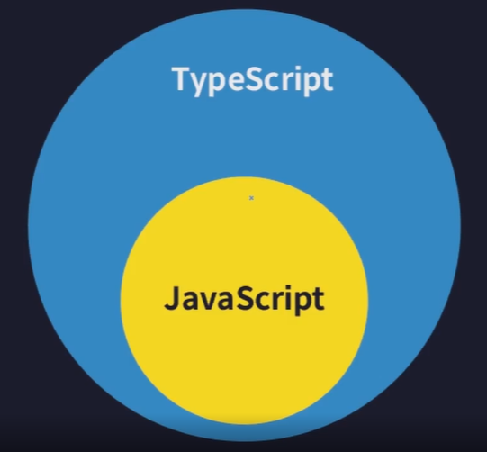
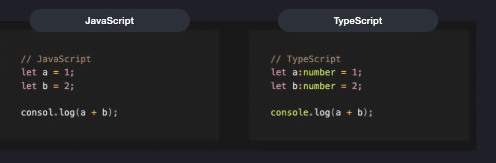
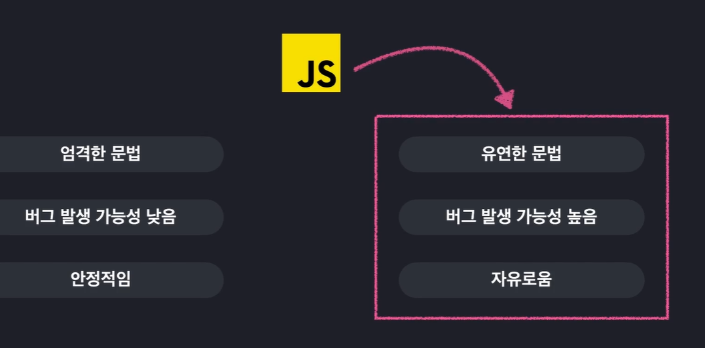

# 타입스크립트 개요

## 타입스크립트 소개

- 창시자

  - MS 개발자이자 C#의 창시자로도 알려진 *Anders Hejlsberg*(앤더스 하일스버그) 

- 오픈소스로 공개되어 있음

  - 언어의 다양성에 대한 다양한 토론도 꾸준히 지속되고 있음.
  - 발전가능성이 높음

- 타입스크립트의 인기

  - "피할 수 없는 대세"

  - STATE OF JS 2022

    - 매년 전 세계 자바스크립트 개발자들을 대상으로 설문조사하는 공신력 있는 단체

    

    - 100명 중 대략 89퍼센트의 자바스크립트 개발자가 타입스크립트를 사용하고 있음.

  - 프론트엔드 개발자 자격요건에도 작성되어 있음.

## 타입스크립트란 어떤 언어일까?

자바스크립트를 더 안전하게 사용할 수 있도록 "타입 관련 기능들을 추가한" 언어 =>"자바스크립트의 확장판"

- 자바스크립트와 다르게 타입스크립트에서는 변수를 선언할 때 변수의 타입을 따로 지정할 수 있다.

## 왜 배워야 할까?

자바스크립트는 원래 웹사이트 내에서 아주 간단한 상호작용 정도를 처리하기 위해 개발되었다. 그래서 굳이 엄격한 문법을 가지고 있지 않아도 되었다. 그래서 쉽고 빠르고 간결하게 작성하기 위해 설계되었다.

 

그러나, nodeJS가 등장하게 되었다. NodeJs 자바스크립트의 런타임, 즉 실행환경을 의미하는데, 자바스크립트를 어디서든 실행 가능하도록 만들 수 있는 자바스크립트 구동기이다.

이 이후에는 웹브라우저에서 실행될 수 있었던 자바스크립트를 어디서든 실행할 수 있게 되었다. 즉, 어떤 프로그램이든 자바스크립트를 활용해서 만들 수 있게 되었다.

이전에 자바스크립트를 사용해서 개발하던 개발자들이 이제 다양한 프로그램을 만들기 시작하였다. 웹서버, 모바일 앱, 데스크탑 앱 등을 만드는데 사용되었다. 

그러나 **복잡한 어플리케이션 만들기 위해선, 안정성을 높일 필요**가 있었고 이러한 버그 발생 가능성을 줄일 필요가 있었다. 그래서 이를 극복하기 위해 **자바스크립트를 좀 더 안전하게 사용할 수 있도록** **타입 관련된 기능들을 추가한** 언어인 `타입스크립트`가 등장하게 되었다. 