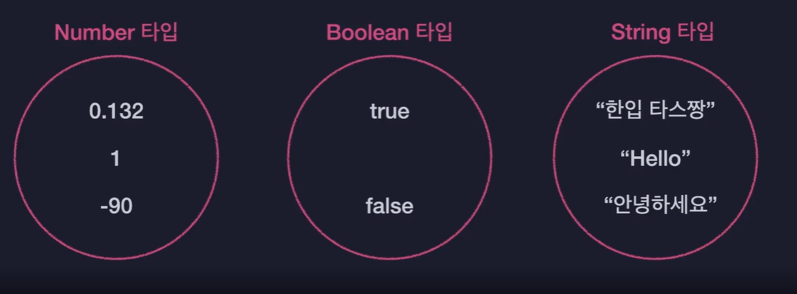
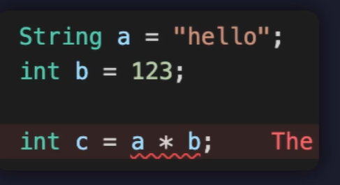
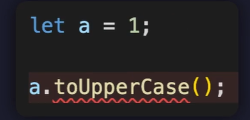

# 자바스크립트의 한계점과 타입스크립트

## 배경지식

### 타입 시스템

언어의 타입과 관련된 문법 체계로 다음과 같은 규칙을 정의한다.

1. 값들을 어떤 기준으로 묶어 타입을 규정할 것인가?

2. 코드의 타입을 언제 검사할지?
3. 어떻게 타입을 검사할지?


이러한 타입시스템에는 두 종류가 있다.

- ✅**정적 타입 시스템** : 엄격하고 고정적인 시스템 
  - 코드 실행 이전 모든 변수의 타입을 고정적으로 결정함
  - C, Java
- ✅**동적 타입 시스템**: 자유롭고 유연한 시스템
  - 코드를 실행하고 나서 그때 그때 마다 유동적으로 변수의 타입을 결정함.
  - Python, **JavaScript**


**자바스크립트**는 동적 타입시스템으로, 변수의 타입들이 코드가 실행되는 도중에 결정되기 때문에 

1. 변수의 타입을 미리 지정하지 않아도 됨.

   ```javascript
   let a = 1; // 숫자
   ```

2. 타입이 하나로 고정되어 있지 않아 아무 타입의 값이나 자유롭게 담을 수 있음. (유연함)

   ```javascript
   let a = "hello"; // 문자열
   a = 12313; // 숫자
   ```


## 자바스크립트의 한계점

그러나 다음과 같은 코드를 작성하면 에러가 발생한다. 그러나 실행은 된다...! 애초에 오류가 발생할 코드를 실행 전에 검사를 거쳐 미리 확인할 수 있다면 문제가 없었겠지만 그렇게 못한다...


이러한 비슷한 문제로 인해 프로그램이 마비되거나 종료되는 문제가 발생할 수 있고, 사용자들은 굉장히 많은 불편함을 호소할 수 있다. 


C, Java 같은 정적 타입시스템 언어에서는 먼저 타입을 정해두기 때문에 이러한 문제가 발생하지 않는다. 



그러나 모든 변수에 타입을 다 지정해주어야 하기 때문에 타이핑 양이 급격하게 증가한다.


## 한계점 극복: 타입스크립트

타입스크립트는 **동적타입시스템과 정적 타입시스템을 결합**한 형태로 작동하게 된다.

- 변수의 타입을 실행 전에 결정
- 타입 오류를 실행 전에 검사


- 변수에 담기는 초기값을 기준으로 알아서 타입을 추론.



- 모든 변수에 타입을 일일이 지정할 필요 없음 = **점진적 타입시템(Gradual Type System)**
  - 실행 전 검사를 통해 타입 안정성을 확보
  - 자동으로 변수의 타입을 추론함


## 정리

