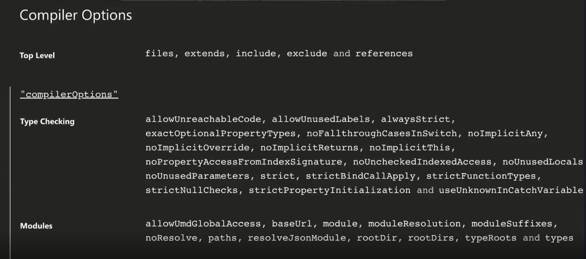
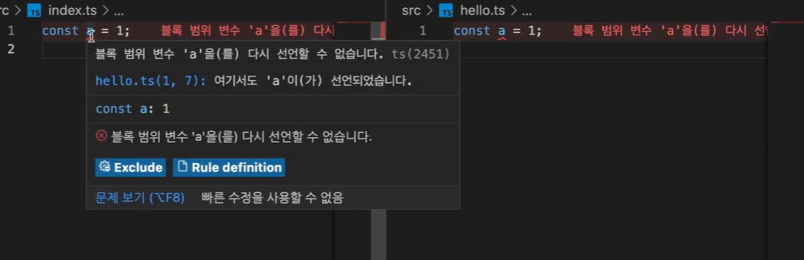
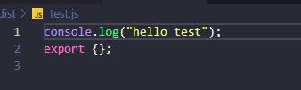
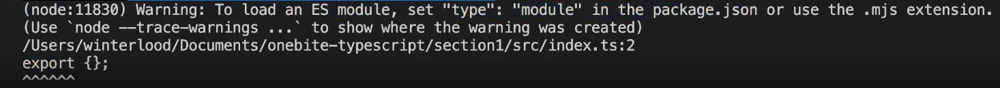
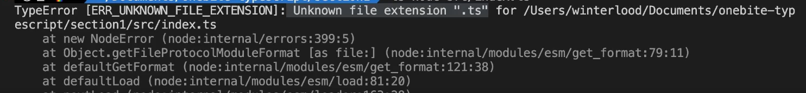

# 타입스크립트 컴파일러 옵션 설정하기

타입스크립트를 자바스크립트로 변환하는 컴파일 과정에서, 컴파일과 관련된 세부적인 사항들을 `컴파일러 옵션`이라고 부른다.




- 프로젝트에 따라 설정할 수 있음.


컴파일러 옵션은 **nodeJS package를 기준으로 설정**할 수 있음.


### 컴파일러 옵션 초기화

```shell
$ tsc --init
```

`tsconfig.json` 파일이 생성됨.


### 컴파일러 옵션 살펴보기

⭐**include**

컴파일 파일들의 위치와 범위를 설정

- 컴파일 해야 하는 파일이 여러 개일 때 그 범위를 지정할 수 있음.

```json
{
  "include": ["src"]
}
```

-> "`src` 폴더 내에 있는 모든 파일을 컴파일 해라" 라는 의미

> 이후 컴파일 할 때는 `tsc` 명령어만 작성하면 됨. 경로 지정할 필요 X


⭐**compilerOptions / target**

컴파일될 자바스크립트 파일의 버전을 설정.

1. `ES5`로 설정

```json
{
	"compilerOptions": {
    "target": "ES5" 
  },
}
```

버전을 `ES5`로 설정한 뒤 화살표 함수를 작성하면, 함수표현식으로 바뀌는 것을 확인할 수 있다.

```typescript
// index.ts
const func = () => console.log("TypeScript");

// index.js(ES5)
var func = function () { return console.log("TypeScript"); };

```

2. `ESNext`로 설정

```json
{
	"compilerOptions": {
    "target": "ESNext" 
  },
}
```

ESNext로 설정하면, 최신 자바스크립트 버전으로 컴파일 된다. 

```javascript
// index.ts
const func = () => console.log("TypeScript");

// index.js(ESNext)
const func = () => console.log("TypeScript");
```


⭐**compilerOptions / module**

모듈 시스템을 설정할 수 있다. 관련 내용은 다른 파일에 따로 정리해 두었다.

1. `CommonJS`

```json
{
  "compilerOptions": {
    "module": "CommonJS"
  },
}
```

- typescript에서는 import 를 사용해서 모듈을 불러오고 export를 통해 모듈을 내보낼 수 있다.

```typescript
// hello.ts
export const hello = () => console.log("hello");
```

```typescript
// index.ts
import { hello } from "./hello";
hello();
```

`tsc`를 통해 해당 파일을 컴파일하면 `commonjs` 형식의 모듈 시스템을 사용하여 작성된 것을 확인할 수 있다.

```javascript
// hello.js
"use strict";
Object.defineProperty(exports, "__esModule", { value: true });
exports.hello = void 0;
const hello = () => console.log("hello");
exports.hello = hello;

```

```javascript
// index.js
"use strict";
Object.defineProperty(exports, "__esModule", { value: true });
const hello_1 = require("./hello");
(0, hello_1.hello)();

```


2. `ESNext`

ES 모듈 시스템을 사용하는 자바스크립트 모듈시스템으로 컴파일된 것을 확인할 수 있다.

```javascript
// hello.js
export const hello = () => console.log("hello");
```

```javascript
// index.js
import { hello } from "./hello";
hello();
```


⭐**compileOptions / outDir**

만들어진 자바스크립트 파일이 어디에 저장될 지 위치를 지정함.

```json
{
  "compilerOptions": {
    "outDir": "dist"
  },
}

```

`dist` 라는 폴더 내부에 자바스크립트 파일을 저장하겠다는 의미이다.


컴파일 해보면 실제로 다음과 같이 나타나게 된다. 


⭐ **compileOptions / strict**

타입스크립트 컴파일러가 검사할 때 얼마나 엄격하게 검사할지를 정함.

```json
{
  "compilerOptions": {
    "strict": true
  },
}
```

아래와 같이 message를 인자로 넘기는 코드를 작성하면 에러를 볼 수 있음.

```typescript
export const hello = (message) => console.log("hello" + message);

```

```javascript
import { hello } from "./hello";

hello();
```


> ❗매개변수의 타입을 무조건 지정해주어야 함
>
> WHY❓ 매개변수의 타입은 추론할 수 없기 때문이다. 타입스크립트는 각 변수의 타입을 추론하여 안정도를 높이는데, 매개변수에 어떤 값을 넣을지 알 수 없기 때문에 추론할 수 없다. 


⭐**compilerOptions / moduleDetection**

타입스크립트가 각각의 파일은 어떤 모듈로 감지할 것인가?

```json
{
  "compilerOptions": {
    "moduleDetection": "force"
  },
  "include": ["src"]
}
```


❗타입스크립트에서는 똑같은 이름의 변수를 두 번이나 선언할 수 없다. 



이는 **모든 타입스크립트 파일을 전역 모듈로 보기 때문이다**. 그래서 `moduleDetection`의 값을 `force`로 두어서 개별 모듈로 처리될 수 있도록 한다. 그러면 다음과 같이 컴파일되어 모든 파일에 `export {}`이 포함되게 된다. 



> 또 다른 해결 방법
>
> `export`나 `import` 키워드를 한 번이라도 사용하면 해당 파일이 독립된 모듈로 인식된다.


⭐**ts-node**

ts-node를 활용해서 바로 실행시키고 싶을 때, 만약 ESM 방식을 사용하고 싶은 경우 다음과 같이 설정해주어야 한다.

❗node를 통해 실행시키면 에러가 발생할 수 있다.



❓Node.JS 환경에서 ESM을 사용하기 위함. `package.json`에 `"type":"module"`을 설정하면 된다.

❗ts-node가  ESM를 이해할 수 없음. 기본적으로 CommonJS 방식으로 돌아가기 때문이다.

❓`"esm": true` 값을 설정해주자.



```json
{
  "compilerOptions": {
    "module": "ESNext",
    "moduleDetection": "force"
  },
	"ts-node": {
		"esm": true
	}
}
```