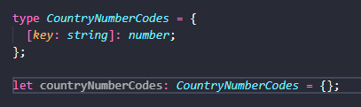
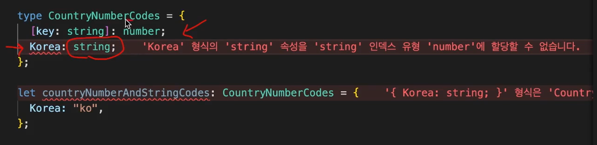

# 타입 별칭과 인덱스 시그니처

## 타입 별칭

새로운 타입을 만들어 변수처럼 호출할 수 있는 방식.

```typescript
// 타입 별칭
type User = {
  id: number;
  name: string;
  location: string;
  birth: string;
};

let user1: User = {
  id: 1,
  name: "sds",
  location: "",
  birth: "1998.11.12",
};

let user2: User = {
  id: 2,
  name: "ssdfds",
  location: "dsfs",
  birth: "1988.12.01",
};
```

❗동일한 스코프 내에서는 중복된 타입을 선언할 수 없다.


## 인덱스 시그니처

key와 value의 타입이 규칙적일 때 사용될 수 있다.

`[key: {type}] : {type}` 과 같이 작성할 수 있다.

```typescript
// 인덱스 시그니처
type CountryCodes = {
  [key: string]: string;
};
// 모든 키와 밸류가 모두 string 타입이다.
let countryCodes: CountryCodes = { 
  Korea: "ko",
  UnitedState: "us",
  UnitedKingdom: "uk",
};

// key는 string이고, value는 number 타입이다.
type CountryNumberCodes = {
  [key: string]: number;
};

let countryNumberCodes: CountryNumberCodes = {
  Korea: 410,
  UnitedState: 840,
  UnitedKingdom: 826,
};
```


❗**주의 사항**

1. 내용이 없더라도 에러를 발생시키지 않는다.인덱스 시그니처를 사용하게 되면 해당 규칙을 위반하지 만 않으면 모든 객체를 허용한다. 

2. 추가적인 프로퍼티의 value의 타입이 인덱스 시그니처로 등록된 형태와 일치하거나 호환해야 함.

   

   