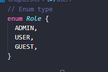
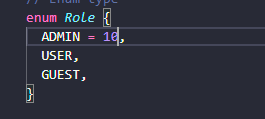
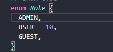

# 열거형 타입

**enum**: 여러가지 값들에 각각 이름을 부여해 열거해두고 사용하는 타입


각 사람의 role을 0(관리자), 1(일반 유저), 2(게스트)로 설정한다고 가정했을 때, 이를 ENUM을 활용하면 좀 더 쉽게 작성할 수 있다.

```typescript
// Enum type
enum Role {
  ADMIN = 0,
  USER = 1,
  GUEST = 2,
}

const user1 = {
  name: "hhh",
  role: Role.ADMIN, // 0: 관리자
};

const user2 = {
  name: "dfdfs",
  role: Role.USER, // 일반 유저
};

const user3 = {
  name: "dfsfsd",
  role: Role.GUEST, // 게스트
};

console.log(user1, user2, user3); // { name: 'hhh', role: 0 } { name: 'dfdfs', role: 1 } { name: 'dfsfsd', role: 2 }

```




위와 같이 숫자를 생략하면 0부터 순서대로 들어가게 된다.



첫 번째 시작 숫자를 지정해주면 10, 11, 12와 같은 순서로 들어가게 된다.



중간부터 설정하면 0, 10, 11으로 설정된다.


이렇게 값이 숫자로 할당되는 enum을 `숫자형 enum`이라고 부른다.

숫자 대신 문자를 넣어서 사용할 수도 있다.

```typescript
enum Language {
  korean = "ko",
  english = "en",
}

const user1 = {
  name: "hhh",
  role: Role.ADMIN,
  language: Language.korean,
};
```


❗enum은 컴파일을 해도 사라지지 않는다. 대신 자바스크립트의 객체로 변환된다.