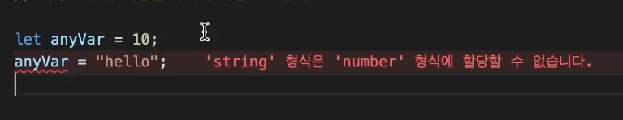
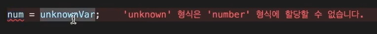
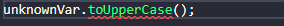
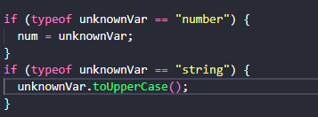

# Any 타입과 Unknown 타입

## Any

특정 변수의 타입을 우리가 확실히 모를 때 사용할 수 있음. 즉 어떤 타입이든 넣을 수 있게 한다. 



타입스크립트는 초기화된 변수의 타입을 기준으로 변수의 타입을 추론하기 때문에 에러가 발생한다.

```typescript
// Any
// 특정 변수의 타입을 우리가 확실히 모를 때 사용할 수 있음
let anyVar: any = 10;
anyVar = "dfs";
anyVar = {};
anyVar = () => {};

anyVar.toUpperCase();

let num: number = 10;
num = anyVar;
```


❗**any를 남발하면 안되는 이유**

`any`는 타입스크립트의 타입 검사를 다 통과하는 "치트키" 같은 특징을 가지고 있기 때문에, **에러가 발생해도 런타임 때 발생하게 된다**.


## Unknown

any와 유사하게 어떤 값이 들어갈지 모를 때 사용될 수 있다. 그러나 다른 변수에 할당하는 것은 안된다. 또 특정 타입의 함수를 사용하는 것 역시 불가능하다.






```typescript
// unknown
let unknownVar: unknown;
unknownVar = "";
unknownVar = 1;
unknownVar = () => {};

num = unknownVar; // 에러발생
unknownVar.toUpperCase(); // 에러발생
```


그렇기 때문에 **미리 타입 검사를 하고 사용해야 한다.**



이러한 과정을 "**타입 정제**"라고 한다.

