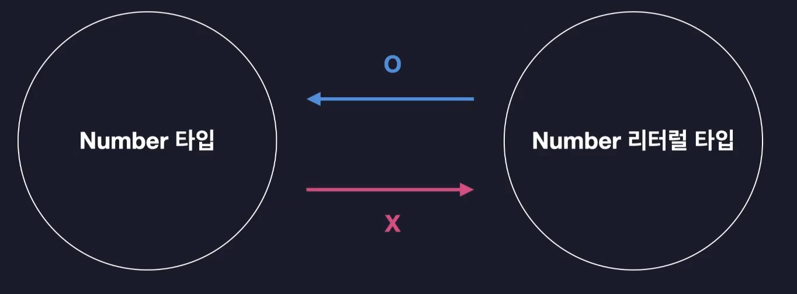

# 타입스크립트 이해하기

## 타입스크립트를 이해한다는 것

- 어떤 기준으로 타입을 정의하는지
- 어떤 기준으로 타입 간의 관계를 정의하는지
- 어떤 기준으로 타입의 오류를 검사하는지

이런 타입스크립트의 **구체적인 원리와 동작 방식을 살펴보는 것**

## 타입은 집합이다

타입은 동일한 속성과 특징을 갖는 집합이며, number Type은 여러 개의 값을 가질 수 있게 된다.

20과 같은 number literal type은 `20`만 포함하는 아주 작은 크기의 집합이다.

즉, number type에 number literal Type이 포함되게 되는데

이러한 관계를 갖는 더 큰 범위의 타입을 `슈퍼타입` 또는 `부모타입`이라고 부르며 속하는 타입은 `서브타입` 또는 `자식타입` 이라고 부른다.

결국 **모든 타입은 집합이며, 부모와 자식 관계를 맺고 있다**.

✅**타입 호환성**

: 어떤 타입을 다른 타입으로 취급해도 괜찮은지 판단하는 것

✅`upcast` : 서브타입을 슈퍼타입으로 바꾸는 것

✅`down cast`: 슈퍼타입을 서브타입으로 바꾸는 것

❗**타입스크립트는 upcast는 허용하지만, downcast는 거의 허용하지 않는다**