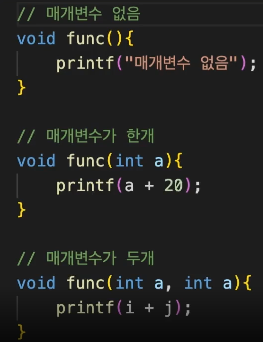

# 함수 오버로딩

함수를 매개변수의 개수나 타입에 따라 여러가지 버전으로 정의하는 방법



이러한 함수 오버로딩은 자바스크립트에서는 지원이 되지 않고, 타입스크립트에서만 지원된다.

하나의 함수 func를 오버로딩하여 두 개의 함수를 만들어볼 것이다. 이 때, 모든 매개변수의 타입은  number이다.

> Ver1. 매개변수가 1개 -> 이 매개변수에 20을 곱한 값 출력
> Ver2. 매개변수가 3개 -> 이 매개변수에 다 더한 값을 출력 

오버로딩을 위해 선언부를 미리 다 작성해주고 구현부를 작성해주어야 하는데, 이 때 선언식만 써놓은 함수 부분을 `오버로드 시그니처`라고 부르며, 함수의 구현부분을 `구현 시그니처`라고 부른다.

공통되지 않은 매개 변수들은 선택적 프로퍼티로 설정해주어야 한다.

```typescript
// 오버로드 시그니처(선언부)
// 구현부 없이 선언식만 써놓은 함수
function func(a: number): void;
function func(a: number, b: number, c: number): void;

// 구현 시그니처(구현부)
// 실제 구현부의 매개변수들은 에러 판단에 영향을 미치지 않는다.
// function func() {}
function func(a: number, b?: number, c?: number) {
  // 공통되지 않는 매개변수는 선택적 프로퍼티로 설정해주어야 한다.
  if (typeof b === "number" && typeof c === "number") {
    console.log(a + b + c);
  } else {
    console.log(a * 20);
  }
}

// func(); // 오버로드 시그니처와 맞지 않아서.
func(1);
// func(1, 2); // 오버로드 시그니처와 맞지 않아서
func(1, 2, 3);
```

함수 호출시, 오버로드 시그니처와 맞지 않게 작성하게 되면 에러를 발생시킨다.