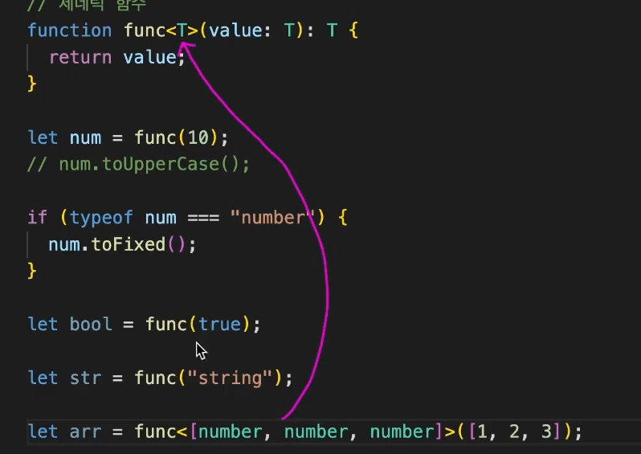

# 제네릭

```typescript
function func(value: string) {
  return value;
}

// 다음과 같이 하고 싶은데 에러가 발생한다.
func(10); // 에러 발생

func(true); // 에러 발생

func("string");

```

이를 해결하기 위해 value의 타입을 `any`로 바꾸면, 에러는 사라지지만 return의 타입도 any 타입이 되어서 다시 타입 좁히기를 해야 하는 불편한 상황에 처하게 된다.

```typescript
// function func(value: string) {
//   return value;
// }

function func(value: any) {
  return value; // any
}

// 다음과 같이 하고 싶은데, value를 any 타입으로 하면 return의 타입도 any 타입이 됨.
let num = func(10);
if (typeof num === "number") {
  num.toFixed();
}

func(true);

func("string");
```


이때 제네릭을 사용하면 좋다.

## 제네릭 함수

```typescript
// 제네릭 함수를 만들어서 사용.
// T: 타입 변수
function func2<T>(value: T): T {
  // T에는 상황에 따라 다른 값이 담긴다.
  return value; // 들어오는 매개 변수에 따라 리턴값의 타입이 결정된다.
}

func2(10); // number

func2(true); // boolean

func2("string"); // string

func2<[number, number, number]>([1, 2, 3]); // [number, number. number] -> T에 할당된다.
// 명시적으로 타입 변수의 타입을 지정할 수도 있다.
```

