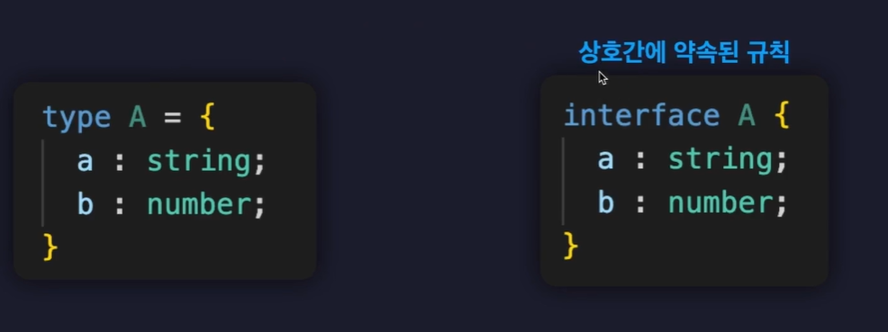

# 인터페이스

타입에 이름을 지어주는 또 다른 문법.

객체 구조를 정의하는데 특화된 문법(상속, 합침 등의 특수한 기능을 제공함.)



type alias(타입 별칭)으로 작성한 것과 굉장히 유사하게 생겼다.

그러나 차이점이 있기 때문에 조심해서 사용해야 한다.

```typescript
interface Person {
  readonly name: string; // 읽기 전용 프로퍼티
  age?: number; // 선택적 프로퍼티
  sayHi(): void; // 호출 시그니처 사용하여 메소드 정의. ()는 함수명 바로 옆에 적어주어야 함.
  sayHi(a: number): void; // 오버로딩을 하기 위해선 호출 시그니처를 사용해야 함.
}
// 인터페이스는 union타입이나 intersection 타입을 만들 수 없다.
type Type1 = number | string;

const person: Person = {
  name: "lea",
  age: 26,
  sayHi: () => console.log("hi"),
};

```

