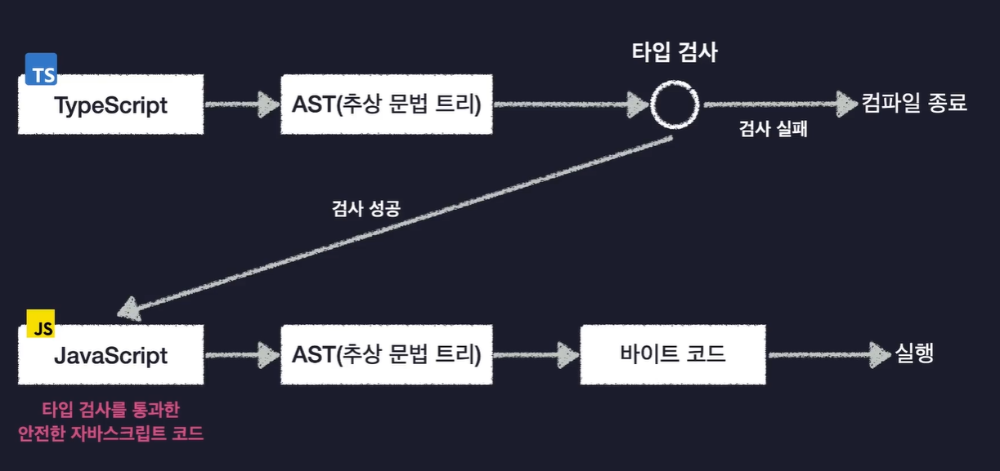

# 타입스크립트의 동작 원리

### 대다수의 프로그래밍 언어는 어떻게 동작할까?

대부분 컴퓨터보단 인간 친화적인 언어로 만들어진다.

이렇게 만들어진 프로그래밍 언어를 기계어로 바꾸어 컴퓨터가 이해하기 쉬운 형태로 변환한다. 

이러한 과정을 "**컴파일**"이라고 하며, 이를 수행하는 도구를 **컴파일러** 라고 부른다.

자바스크립트 코드는 컴파일 하면 바이트 코드로 변환된다.

### 자바스크립트의 컴파일 과정

1. JavaScript -> AST 변환

   자바스크립트는 바로 바이트 코드로 변환되는 것이 아니라, AST(추상 문법 트리)로 먼저 만들어지게 된다. 

   코드의 공백이나 주석 탭 등의 코드 실행에 관계없는 부분을 모두 제거하고 트리 형태의 자료 구조에 코드를 쪼개어 저장.

2. AST -> 바이트 코드 변환

### 타입스크립트의 컴파일 과정

1. 타입스크립트 코드 -> AST

2. 타입 검사(Type Checking)

   - 검사 실패 시 컴파일 종료

     

3. AST -> 자바스크립트

   

   

**타입스크립크 -> 자바스크립트**

- 컴파일 시에 타입 검사를 함으로써 오류를 사전에 잡아낼 수 있음. 

- 타입 관련된 코드들을 모두 사라지기 때문에 동작하는 데에는 아무런 문제가 없음.