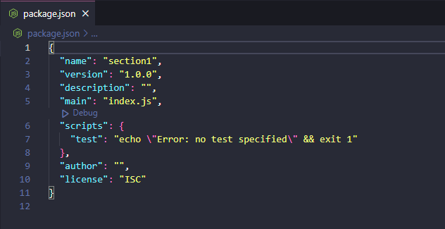
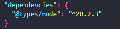
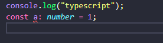
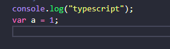

# Hello TS

### nodeJS 초기화

```shell
$ npm init
```

다 default로 설정하면 package.json 이 생성됨




### types/node 패키지 설치

```shell
$ npm i @types/node
```




### 타입스크립트 컴파일러 설치

```shell
$ npm install typescript -g
```

`-g` : 컴퓨터 전체에 설치.


**설치가 잘 되었는지 확인**

```shell
tsc -v
```

`Version 5.0.4`가 나오는 것을 확인


### 타입스크립트 파일 생성

`.ts` 의 확장자를 가진 파일을 생성하면 된다.


### 타입스크립트 파일을 자바스크립트 파일로 컴파일

```shell
$tsc index.ts
```

위와 같이 작성하게 되면 index.js 파일이 생성됨





=> 타입관련된 코드들은 자바스크립트에서는 삭제됨. 


### 컴파일된 자바스크립트 파일 실행

```shell
node index.js
```


### ts-node 패키지 설치 후 실행

타입스크립트 컴파일러와 NodeJS가 함께 있는 형태라서 **컴파일 뒤 바로 실행**할 수 있도록 함.

```shell
npm install ts-node -g  # 설치
ts-node index.ts # 실행
```


