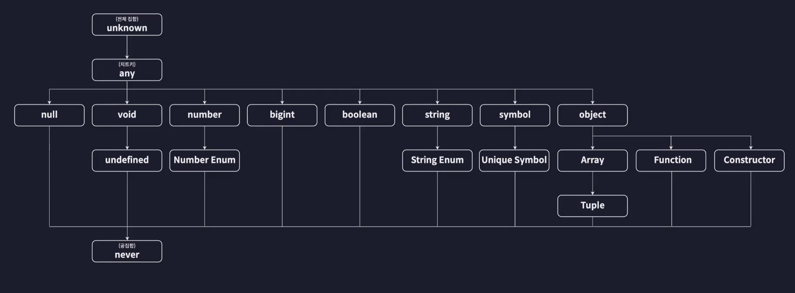
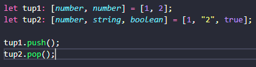
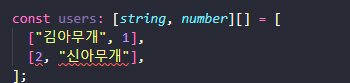
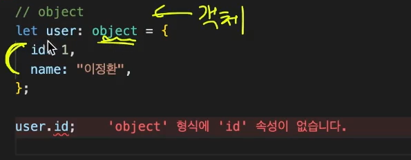
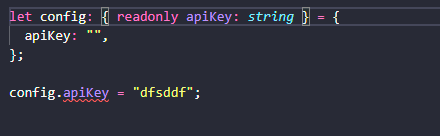

# 타입스크립트의 기본 타입

**기본타입**: 타입스크립트가 자체적으로 제공하는 타입



자바스크립트에서 사용하고 있는 타입과 자바스크립트에서 사용되지 않는 타입들이 있다.


## **원시타입(Primitive Type)**

: 하나의 값만 저장하는 타입

ex) `number`, `string`, `boolean`, `null`, `undefined`


✅**type annotaition**

아래와 같이 `:`으로 타입을 지정하는 방식을 의미한다.

```typescript
let num1: number = 123; 
```


**원시 타입 사용 예시**

```typescript
// number
let num1: number = 123;
let num2: number = -124;
let num3: number = 0.124;
let num4: number = -0.124;
let num5: number = Infinity;
let num6: number = -Infinity;
let num7: number = NaN;

// string
let str1: string = "hello";
let str2: string = `hello`;
let str3: string = 'hello';
let str4: string = `hello ${num1}`;

// boolean
let bool1: boolean = true;
let bool2: boolean = false;

// null
let null1: null = null;

// undefined
let unde1: undefined = undefined;

// 리터럴 타입: 특정 값만 허용
let numA: 10 = 10;
let strA: "dd" = "dd";
```


⭐**compilerOptions / strictNullChecks**

엄격하게 `null`을 검사하는 여부를 결정한다.

```json
{
  "compilerOptions": {
    "strictNullChecks": false
  },
}

```

**null 값이 들어가도 에러가 나지 않는다.**

```typescript
let numA: number = null;
```


## 참조 타입(Reference Type)

### 배열

배열의 타입을 작성하는 방법은 두 가지이다.

이전과 같이 `type annotation`을 활용하여 작성하는 방법과 `제네릭 문법`을 활용하는 방식이다.

```typescript
// 배열
// - type annotation
let numArr: number[] = [1, 2, 3];
let strArr: string[] = ["hello", "im", "lea"];

// - generic
let boolArr: Array<boolean> = [true, false, true];

// 배열의 들어가는 요소들의 타입이 다양할 경우? -> union type | 을 사용
let multiArr: (string | number)[] = [1, "Hello"];

// 다차원 배열의 타입을 정의하는 방법
let doubleArr:number[][] = [
  [1, 2, 3],
  [4, 5],
];
```


### 튜플

**길이와 타입이 고정된 배열**을 의미한다.

```typescript
let tup1: [number, number] = [1, 2];
let tup2: [number, string, boolean] = [1, "2", true];
```


❗사이즈를 고정해두어도 배열로 인식되기 때문에 `push`나 `pop`을 사용했을 때 에러가 발생하지 않는다.



다음과 같은 상황을 체크하기 위해 사용될 수 있다.




### 객체

단순히 객체의 타입을 `object`로 지정하면 해당 객체의 프로퍼티에 접근할 수 없는 상황이 발생한다.



그래서 `객체 리터럴 타입`을 활용해서 작성한다.

```typescript
// 객체
let user: { id: number; name: string } = {
  id: 1,
  name: "lea",
};
```


> **타입스크립트**는 객체를 이루는 프로퍼티가 어떻게 생겼는지, 즉 **구조를 기준으로 타입을 정의하는 구조적 타입 시스템(Property Based Type System)**이다.
>
> 이름을 기준으로 타입을 정의하는 시스템은 명목적 타입시스템이라고 부른다.


✅**optional property(`?`)**

특정 프로퍼티를 선택적으로 하고 싶을 때 `?`를 사용한다.

```typescript
// 객체
let user: { id?: number; name: string } = {
  id: 1,
  name: "lea",
};

user = {
  name: "홍길동",
};

```


✅**readonly**

 `readonly`를 사용하면 읽기 전용(수정 불가능한) 프로퍼티를 설정할 수 있다.




