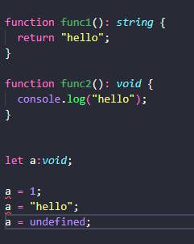
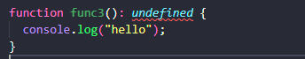
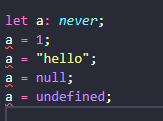

# Void와 Never 타입

## Void

"**아무것도 없음**"을 의미하는 타입

함수에서 아무것도 반환하지 않거나 변수의 값이 undefined일 때만 사용될 수 있다.



```typescript
function func1(): string {
  return "hello";
}

function func2(): void {
  console.log("hello");
}

let a:void;

a = 1; // error
a = "hello"; // error
a = undefined; // 가능
```

❗`strictNullCheck`를 끄면 이때는 null값도 넣을 수 있게 된다.


굳이 undefined이나 null 대신 void가 생겨난 이유? 그 차이는 무엇일까?



위의 사진과 같이 아무것도 반환하지 않을 때 undefined로 설정하게 되면 에러가 발생한다. 그래서 다음과 같이 명시적으로 undefined를 반환할 때만 함수의 리턴값의 타입을 undefined로 설정할 수 있다. (null 도 동일)

```typescript
function func3(): undefined {
  console.log("hello");
  return;
  // return undefined
}
```


## Never

**존재하지 않는, 불가능한 타입**을 의미한다.

```typescript
// never
// never -> 존재하지 않는, 불가능한 타입
function func5() : never {
  while (true) {} // 애초에 반환하지 못함.
}

function func6(): never {
  throw new Error();
}
```

절대로 정상적으로 종료될 수 없어서 반환값이 존재하지 않을 때 `never` 타입을 사용한다.



never는 **어떠한 값도 담을 수 없다**.

❗`strictNullCheck`를 꺼도 null값도 넣을 수 없다.