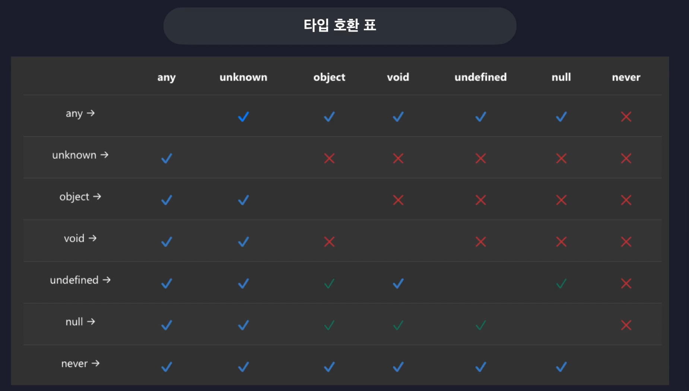

# 타입계층도와 기본타입


기본적으로 다운캐스팅은 불가능 하지만 any는 예외이다.

`unknown` -> `any`, `any` -> `undefined` 로의 다운 캐스팅이 가능하다. 그러나 any -> never는 되지 않는데, never는 그 어떠한 누구라도 담길 수 없기 때문이다.

```typescript
// Unknown

function unknownExam() {
  // 업캐스팅은 모두 가능
  let a: unknown = 1;
  let b: unknown = "hello";
  let c: unknown = true;
  let d: unknown = null;
  let e: unknown = undefined;

  // 다운캐스팅은 불가능
  let unknownVar: unknown;

  // let num: number = unknownVar;
  // let str: string = unknownVar;
  // let bool: boolean = unknownVar;
}

// Never -> 공집합
function neverExam() {
  function neverFunc(): never {
    while (true) {}
  }

  // 업캐스팅은 모두 가능
  let num: number = neverFunc();
  let str: string = neverFunc();
  let bool: boolean = neverFunc();

  let never: never;

  // 다운 캐스팅은 모두 불가능
  // never = 10;
  // never = "dfsd";
  // never = true;
}

// void
function voidExam() {
  function voidFunc(): void {
    console.log("hi");
  }

  // 업캐스팅 가능.
  let voidVar: void = undefined;
}

// any
function anyExam() {
  let unknownVar: unknown;
  let anyVar: any;
  let undefinedVar: undefined;
  let neverVar: never;

  // 다운 캐스팅임에도 불구하고 허용이 된다.
  anyVar = unknownVar;

  // 다운 캐스팅도 된다
  undefinedVar = anyVar;

  // 즉 모든 규칙을 무시하는 치트키 타입이다.

  // 그러나 any도 never 타입으로는 다운 캐스팅 불가능.
  // neverVar = unknownVar;
}

```


