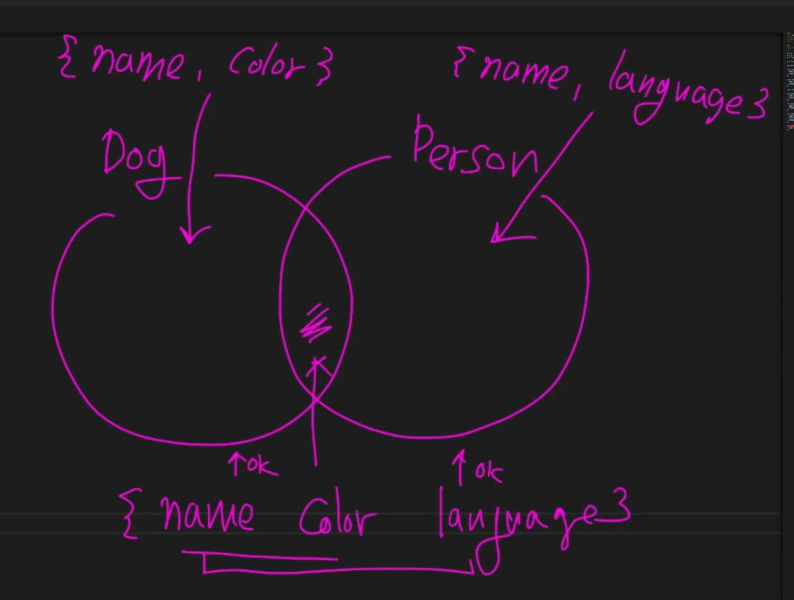
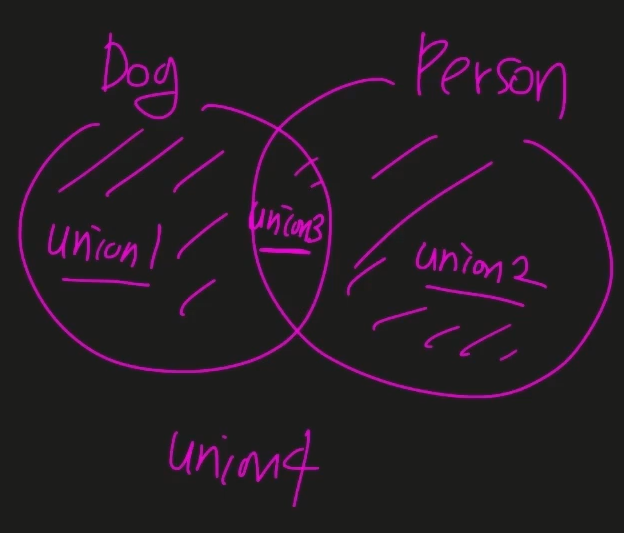

# 대수 타입

여러 개의 타입을 합성해서 새롭게 만들어낸 타입

## 합집합(union)

`|`를 이용해 여러 타입을 동시에 사용할 수 있게 한다.

```typescript
// union
let a: string | number; // string number union type
a = 1;
a = "fdfd";
```


Dog, Person을 정의하고 이를 바탕으로 객체 4개를 만든다.

```typescript

type Dog = {
  name: string;
  color: string;
};

type Person = {
  name: string;
  language: string;
};

type Union1 = Dog | Person;

let union1: Union1 = {
  name: "",
  color: "",
};

let union2: Union1 = {
  name: "",
  language: "",
};

let union3: Union1 = {
  name: "",
  color: "",
  language: "",
};

// 에러 발생
// let union4: Union1 = {
//   name: "",
// };
```



union4는 Dog 도 Person 타입에도 포함되지 않는다.




## 교집합(intersection)

`&`를 사용해 교집합을 나타낼 수 있다.

```typescript
let variable: number & string; // 둘의 교집합이 없기 때문에 never가 된다.

type Intersection = Dog & Person;

let intersection: Intersection = {
  name: "",
  color: "",
  language: "",
};
```

Dog와 Person의 모든 프로퍼티를 가져야만 Intersection 타입이라 할 수 있다.

