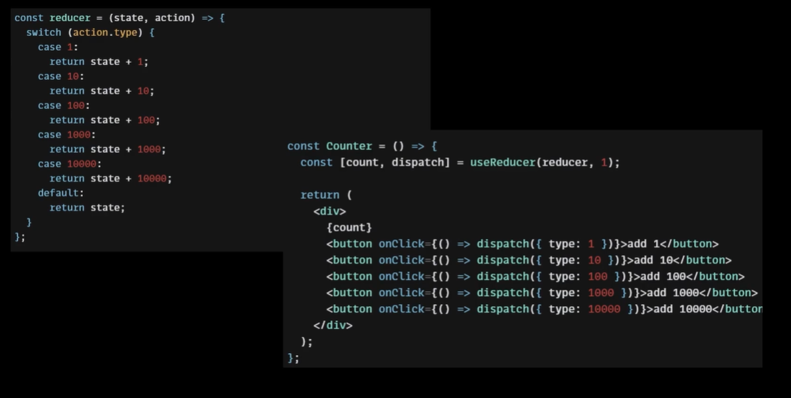

# React - 복잡한 상태변화 로직 분리

## useReducer

컴포넌트에서 상태변화 로직을 분리할 수 있도록 도와주는 React Hooks

 

```javascript
const [count, dispatch] = useReducer(reducer, 1);
```

[]의 첫번째 index는 `state`. 두번째 index는 `dispatch`로, 상태를 변화시키는 action을 발생시키는 함수이다.

`useReduce`의 첫번째 인자는 `reducer`로, 일어난 상태변화를 처리해주는 함수이다. 두번째 인자는 state의 초기값이다.

버튼을 누르면 dispatch함수가 실행이 되는데, 객체와 함께 전달이 됨. 이는 `action` 객체로, `type`이 포함된 상태로 전달이 된다. 

`reducer`는 첫번째 인자에는 `state`, 두번째 인자는 `action`을 받게 되는데, 이때 `action`은 이전에 `dispatch`에서 전달한 객체이며 `type`을 포함하고 있다. 변화된 state 값을 return하여 새로운 state를 저장한다.

## OnCreate, OnRemove, OnEdit, GetData 함수 정리

`type`을 `INIT`, `CREATE`, `REMOVE`, `EDIT`으로 하여 이전에 작성된 코드를 정리한다.

```javascript
// App.js
import { useEffect, useRef, useMemo, useCallback, useReducer } from "react";
import "./App.css";
import DiaryEditor from "./DiaryEditor";
import DiaryList from "./DiaryList";

const reducer = (state, action) => {
  switch (action.type) {
    case "INIT": {
      return action.data;
    }
    case "CREATE": {
      const created_date = new Date().getTime();
      const newItem = {
        ...action.data,
        created_date,
      };
      return [newItem, ...state];
    }
    case "REMOVE": {
      return state.filter((it) => it.id !== action.targetId);
    }
    case "EDIT": {
      return state.map((it) =>
        it.id === action.targetId ? { ...it, content: action.newContent } : it
      );
    }
    default:
      return state;
  }
};

function App() {
  const [data, dispatch] = useReducer(reducer, []);
  const dataId = useRef(0);
  const getData = async () => {
    const res = await fetch(
      "https://jsonplaceholder.typicode.com/comments"
    ).then((res) => res.json());
    const initData = res.slice(0, 20).map((it) => {
      return {
        author: it.email,
        content: it.body,
        emotion: Math.floor(Math.random() * 5) + 1,
        created_date: new Date().getTime(),
        id: dataId.current++,
      };
    });
    dispatch({ type: "INIT", data: initData });
  };
  useEffect(() => {
    getData();
  }, []);

  const onCreate = useCallback((author, content, emotion) => {
    dispatch({
      type: "CREATE",
      data: { data: author, content, emotion, id: dataId.current },
    });
  }, []);

  const onRemove = useCallback((targetId) => {
    dispatch({ type: "REMOVE", targetId });
  }, []);

  const onEdit = useCallback((targetId, newContent) => {
    dispatch({ type: "EDIT", targetId, newContent });
  }, []);

  const getDiaryAnalysis = useMemo(() => {
    const goodCount = data.filter((it) => it.emotion >= 3).length;
    const badCount = data.length - goodCount;
    const goodRatio = (goodCount / data.length) * 100;
    return { goodCount, badCount, goodRatio };
  }, [data.length]);

  const { goodCount, badCount, goodRatio } = getDiaryAnalysis;

  return (
    <div className="App">
      <DiaryEditor onCreate={onCreate} />
      <div>전체 일기 : {data.length}</div>
      <div>기분 좋은 일기 : {goodCount}</div>
      <div>기분 나쁜 일기 : {badCount}</div>
      <div>기분 좋은 일기 비율 : {goodRatio}</div>
      <DiaryList diaryList={data} onRemove={onRemove} onEdit={onEdit} />
    </div>
  );
}

export default App;
```
