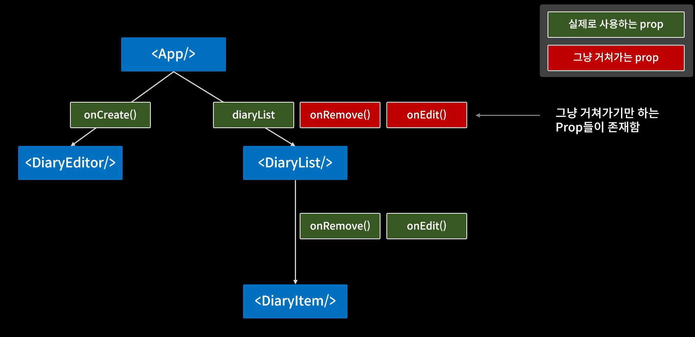
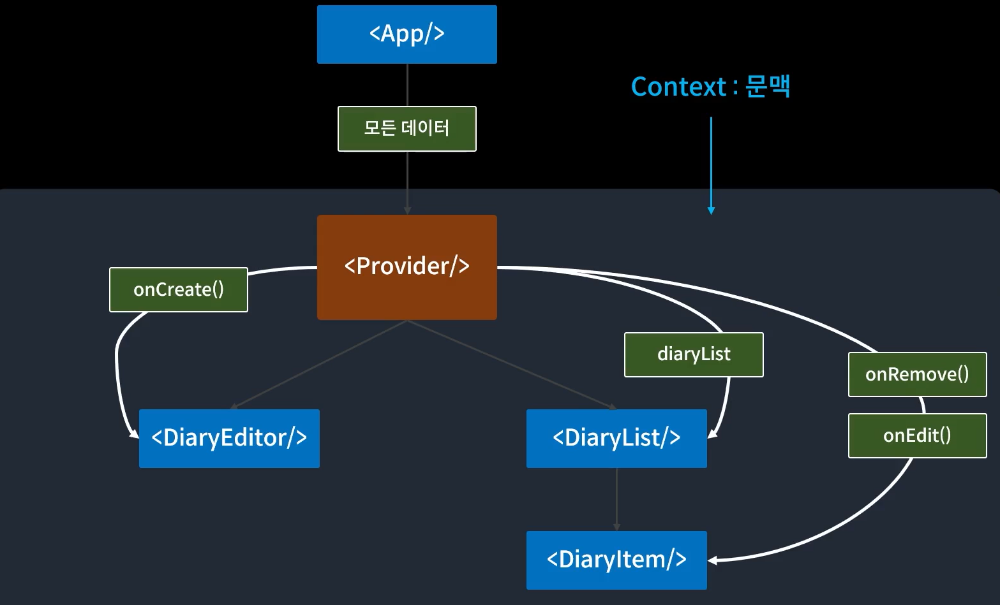

# React - 컴포넌트 트리에 데이터 공급

**keyword**: `props drilling`, `context API`, `Provider`, `export default`, `export const`, `비구조화할당`

## props drilling

 

props의 값을 하위 컴포넌트에 전달하기 위해 중간 컴포넌트에 의미없이 전달되는 현상을 의미.


## Context API



 `Provider`라는 컴포넌트는 모든 컴포넌트에게 데이터를 직접 전달할 수 있음.

`context(문맥)`: 해당 `Provider` 컴포넌트가 제공하는 데이터에 접근할 수 있는 모든 컴포넌트들의 영역을 의미한다. 

-> 이를 통해 `props drilling` 문제를 해결할 수 있음

### Context 생성

```javascript
const MyContext = React.createContext(defaultValue);
```

### Context Provider를 통한 데이터 공급

```javascript
<MyContext.Provider value = {전역으로 전달하고자 하는 값}>
  {/*이 context안에 위치할 자식 컴포넌트*/}
</MyContext.Provider>
```


 **`export default`와 `export`의 차이?**

`export default`는 파일 하나당 하나만 사용할 수 있음. 

`export`는 여러 개 사용가능.

```javascript
import React, {useEffect, useState} from "react";
```

`React`는  import 시 이름을 바꿔서 import할 수 있음. `export default`을 했기 때

`useEffect`, `useState`는 import시 이름을 바꿀 수 없음. `export const ~~`로 내보낸 변수들은 `비구조화할당`으로만 받을 수 있음.


### Context API 사용하기

```javascript
// App.js
export const DiaryStateContext = React.createContext();

const App = () => {
  return (
    <DiaryStateContext.Provider value={data}>
      <div className="App">
        <DiaryEditor onCreate={onCreate} />
        <div>전체 일기 : {data.length}</div>
        <div>기분 좋은 일기 : {goodCount}</div>
        <div>기분 나쁜 일기 : {badCount}</div>
        <div>기분 좋은 일기 비율 : {goodRatio}</div>
        <DiaryList onRemove={onRemove} onEdit={onEdit} />
      </div>
    </DiaryStateContext.Provider>    
  );
}
```

`DiaryStateContext.Provider`로 나머지 컴포넌트를 모두 감싸줌. 그러고 나서 전달하고 싶은 데이터를 전달. `props` 로 전달하던 diaryList 지우기.


```javascript
// DiaryList.js
import { useContext } from "react";
import DiaryItem from "./DiaryItem";

import { DiaryStateContext } from "./App";

const DiaryList = ({ onRemove, onEdit }) => {
  const diaryList = useContext(DiaryStateContext);
  return (
    <div className="DiaryList">
      <h2>일기 리스트</h2>
      <h4>{diaryList.length}개의 일기가 있습니다.</h4>
      <div>
        {diaryList.map((it) => (
          <DiaryItem key={it.id} {...it} onRemove={onRemove} onEdit={onEdit} />
        ))}
      </div>
    </div>
  );
};

DiaryList.defaultProps = {
  diaryList: [],
};

export default DiaryList;

```

`useContext`를 통해 `diaryList`를 받아올 수 있음. 이전에 작성했던 `DiaryStateContext`의 context를 사용하기 위해 인자로 전달함. 이를 위해 `useContext`와 `DiaryStateContext`를 미리 import 해야 함.


### 그럼 현재 남아있는 onEdit, onCreate, onRemove와 같은 props도 value로 전달하면 될까?

대답은 No. 그 이유는 Provider도 결국 Component이기 때문이다. 

즉, props가 바뀌면 Provider 컴포넌트도 재생성되는데, 그 `Provider` 하위의 component들도 재생성된다. 그래서 **`data`의 값이 변화할 때마다 리렌더링되면, `onCreate`, ...와 같은 모든 함수들도 다시 전달되어 이전에 만들어두었던 최적화가 모두 쓸모없어진다.**


```javascript
// App.js
import React, {
  useEffect,
  useRef,
  useMemo,
  useCallback,
  useReducer,
} from "react";
import "./App.css";
import DiaryEditor from "./DiaryEditor";
import DiaryList from "./DiaryList";

const reducer = (state, action) => {
  switch (action.type) {
    case "INIT": {
      return action.data;
    }
    case "CREATE": {
      const created_date = new Date().getTime();
      const newItem = {
        ...action.data,
        created_date,
      };
      return [newItem, ...state];
    }
    case "REMOVE": {
      return state.filter((it) => it.id !== action.targetId);
    }
    case "EDIT": {
      return state.map((it) =>
        it.id === action.targetId ? { ...it, content: action.newContent } : it
      );
    }
    default:
      return state;
  }
};

export const DiaryStateContext = React.createContext();
export const DiaryDispatchContext = React.createContext();

const App = () => {
  const [data, dispatch] = useReducer(reducer, []);
  const dataId = useRef(0);
  const getData = async () => {
    const res = await fetch(
      "https://jsonplaceholder.typicode.com/comments"
    ).then((res) => res.json());
    const initData = res.slice(0, 20).map((it) => {
      return {
        author: it.email,
        content: it.body,
        emotion: Math.floor(Math.random() * 5) + 1,
        created_date: new Date().getTime(),
        id: dataId.current++,
      };
    });
    dispatch({ type: "INIT", data: initData });
  };
  useEffect(() => {
    getData();
  }, []);

  const onCreate = useCallback((author, content, emotion) => {
    dispatch({
      type: "CREATE",
      data: { data: author, content, emotion, id: dataId.current },
    });
  }, []);

  const onRemove = useCallback((targetId) => {
    dispatch({ type: "REMOVE", targetId });
  }, []);

  const onEdit = useCallback((targetId, newContent) => {
    dispatch({ type: "EDIT", targetId, newContent });
  }, []);

  const memoizedDispatches = useMemo(() => {
    return { onCreate, onRemove, onEdit };
  }, []);

  const getDiaryAnalysis = useMemo(() => {
    const goodCount = data.filter((it) => it.emotion >= 3).length;
    const badCount = data.length - goodCount;
    const goodRatio = (goodCount / data.length) * 100;
    return { goodCount, badCount, goodRatio };
  }, [data.length]);

  const { goodCount, badCount, goodRatio } = getDiaryAnalysis;

  return (
    <DiaryStateContext.Provider value={data}>
      <DiaryDispatchContext.Provider value={memoizedDispatches}>
        <div className="App">
          <DiaryEditor/>
          <div>전체 일기 : {data.length}</div>
          <div>기분 좋은 일기 : {goodCount}</div>
          <div>기분 나쁜 일기 : {badCount}</div>
          <div>기분 좋은 일기 비율 : {goodRatio}</div>
          <DiaryList/>
        </div>
      </DiaryDispatchContext.Provider>
    </DiaryStateContext.Provider>
  );
};

export default App;


```


먼저 `DiaryDispatchContext.Provider`를 `DiaryStateContext.Provider` 안에 넣어주고 value로 `onCreate`, `onRemove`, `onEdit` 함수를 전달하면 되는데 이를 하나의 객체에 담아 전달한다.

`memoizedDispatches` 라는 객체 안에 `onCreate`, `onRemove`, `onEdit` 함수를 `useMemo`로 감싸서 넣어준다.  `useMemo`로 감싸주는 이유는, App component가 재생성될 때, `memoizedDispatches` 객체가 재생성되는 것을 막아주기 위함이다. 

그리고 전달받던 `props`로 전달받던 `onCreate`, `onRemove`, `onEdit`를 모두 지워준다.


```javascript
// DiaryEditor.js
import React, { useContext, useEffect, useRef, useState } from "react";
import { DiaryDispatchContext } from "./App";

const DiaryEditor = () => {
  const { onCreate } = useContext(DiaryDispatchContext);

  const authorInput = useRef();
  const contentInput = useRef();
  const [state, setState] = useState({
    author: "",
    content: "",
    emotion: 1,
  });

  const handleChangeState = (e) => {
    setState({
      ...state,
      [e.target.name]: e.target.value,
    });
  };

  const handleSubmit = () => {
    if (state.author.length < 1) {
      authorInput.current.focus();
      return;
    }
    if (state.content.length < 5) {
      contentInput.current.focus();
      return;
    }
    onCreate(state.author, state.content, state.emotion);
    setState({
      author: "",
      content: "",
      emotion: 1,
    });
  };

  return (
    <div className="DiaryEditor">
      <h2>오늘의 일기</h2>
      <div>
        <input
          ref={authorInput}
          value={state.author}
          name="author"
          onChange={handleChangeState}
        />
      </div>
      <div>
        <textarea
          ref={contentInput}
          value={state.content}
          name="content"
          onChange={handleChangeState}
        />
      </div>
      <div>
        <select
          name="emotion"
          value={state.emotion}
          onChange={handleChangeState}
        >
          <option value={1}>1</option>
          <option value={2}>2</option>
          <option value={3}>3</option>
          <option value={4}>4</option>
          <option value={5}>5</option>
        </select>
      </div>
      <div>
        <button onClick={handleSubmit}>일기 저장하기</button>
      </div>
    </div>
  );
};

export default React.memo(DiaryEditor);

```


```javascript
// DiaryList.js
import { useContext } from "react";
import DiaryItem from "./DiaryItem";

import { DiaryStateContext } from "./App";

const DiaryList = () => {
  const diaryList = useContext(DiaryStateContext);
  return (
    <div className="DiaryList">
      <h2>일기 리스트</h2>
      <h4>{diaryList.length}개의 일기가 있습니다.</h4>
      <div>
        {diaryList.map((it) => (
          <DiaryItem key={it.id} {...it} />
        ))}
      </div>
    </div>
  );
};

DiaryList.defaultProps = {
  diaryList: [],
};

export default DiaryList;

```


```javascript
// DiaryItem.js
import React, { useContext, useRef, useState } from "react";
import { DiaryDispatchContext } from "./App";

const DiaryItem = ({ id, author, content, emotion, created_date }) => {
  const { onRemove, onEdit } = useContext(DiaryDispatchContext);
  const [isEdit, setIsEdit] = useState(false);
  const toggleIsEdit = () => setIsEdit(!isEdit);
  const [localContent, setLocalContent] = useState(content);
  const localContentInput = useRef();

  const handleRemove = () => {
    if (window.confirm(`${id}번째 일기를 정말 삭제하시겠습니까?`)) {
      onRemove(id);
    }
  };
  const handleQuitEdit = () => {
    setIsEdit(false);
    setLocalContent(content);
  };

  const handleEdit = () => {
    if (localContent.length < 5) {
      localContentInput.current.focus();
      return;
    }
    if (window.confirm(`${id}번째 일기를 수정하시겠습니까?`)) {
      onEdit(id, localContent);
      toggleIsEdit();
    }
  };
  return (
    <div className="DiaryItem">
      <div className="Info">
        <span>
          작성자 : {author} | 감정점수 : {emotion}
        </span>
        <br />
        <span className="date">{new Date(created_date).toLocaleString()}</span>
        <div className="content">
          {isEdit ? (
            <>
              <textarea
                ref={localContentInput}
                value={localContent}
                onChange={(e) => setLocalContent(e.target.value)}
              />
            </>
          ) : (
            content
          )}
        </div>
        <div>
          {isEdit ? (
            <>
              <button onClick={handleQuitEdit}>수정 취소</button>
              <button onClick={handleEdit}>수정 완료</button>
            </>
          ) : (
            <>
              <button onClick={handleRemove}>삭제하기</button>
              <button onClick={toggleIsEdit}>수정하기</button>
            </>
          )}
        </div>
      </div>
    </div>
  );
};

export default React.memo(DiaryItem);

```


