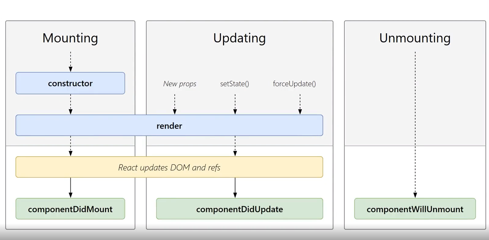
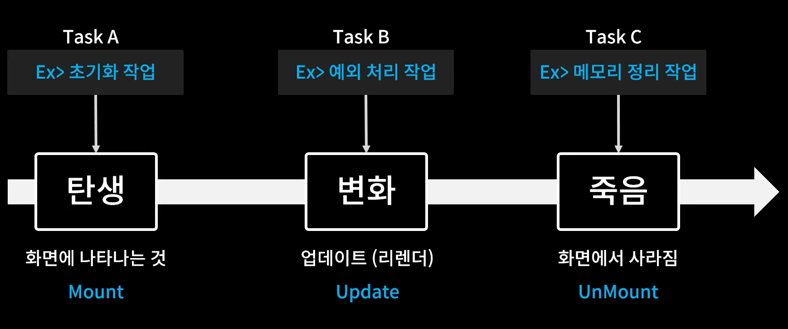
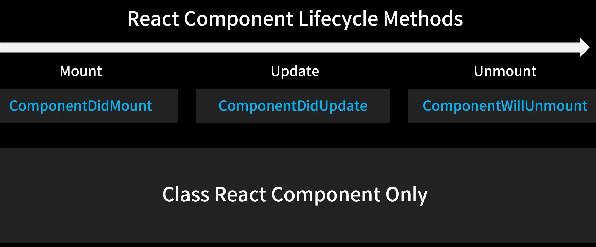
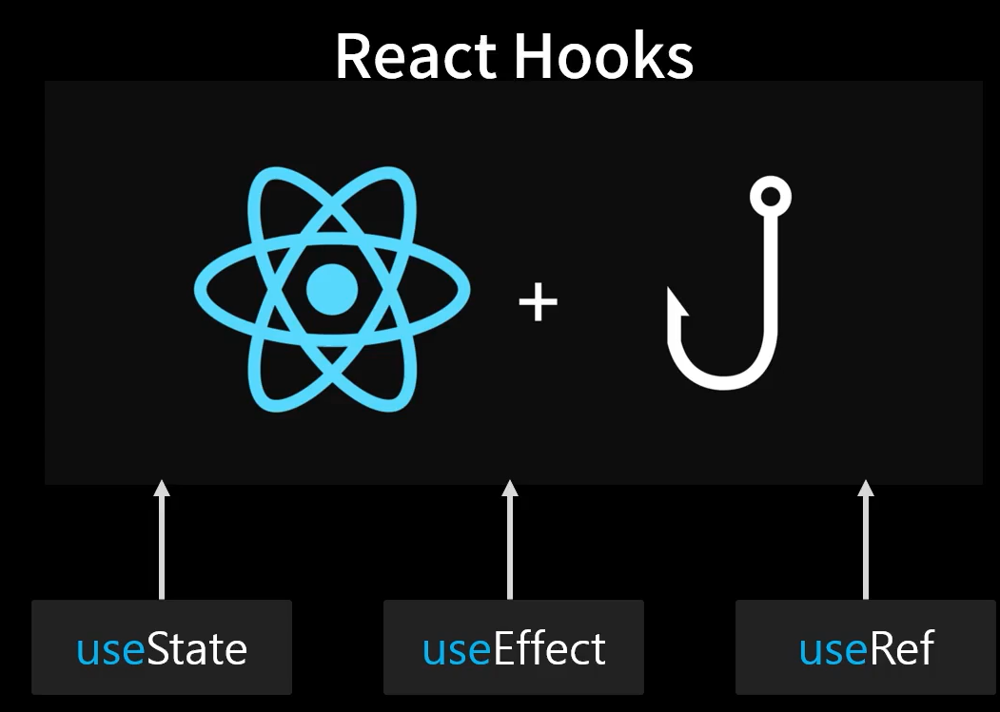
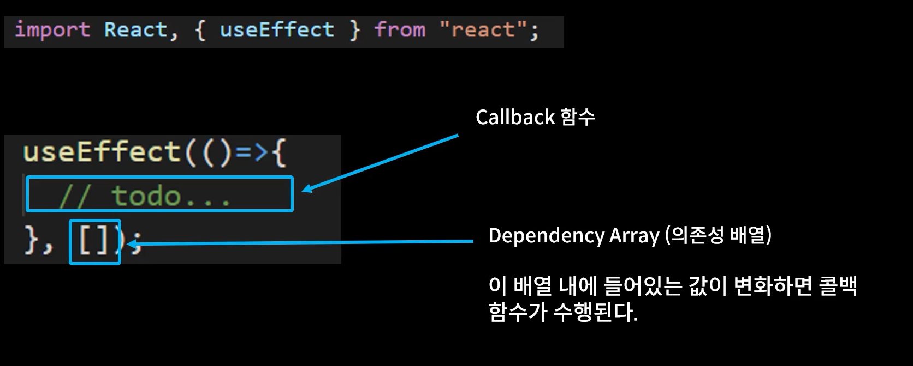

# React Lifecycle 제어하기 - useEffect

어떤 프로그램이 실행되고 종료되는 시점까지 -> lifecycle

## Lifecycle







lifecycle을 제어하는 함수들이 존재하지만, "class" 형 리액트 컴포넌트만 사용할 수 있음.

### React Hook



use를 앞에 붙여서, 원래 클래스 형 컴포넌트가 근본적인 기능을 hook(낚아채서)하여 함수형 컴포넌트가 사용할 수 있도록 만들어 놓은 것들을 의미. (함수형은 원래 못썼음) 

그렇다면 왜 함수형 컴포넌트를 사용하는 것인가?(왜 클래스형 컴포넌트가 대체되었는가?)

클래스형 컴포넌트를 사용하게 되면,

1. 함수형 컴포넌트보다 비교적 더 많은 코드를 작성해야 함.

2. 더 복잡함.

3. 중복 코드를 많이 써야 함.

### useEffect

함수형 컴포넌트가 리액트의 lifecycle을 관리할 수 있도록 하는 react hooks 라고 생각하면 됨.



배열 내에 들어있는 값이 변화할 때마다, 콜백함수가 수행됨.

## Mount, Update 될 때 콜백함수 실행

```javascript
import React, { useEffect, useState } from "react";
const Lifecycle = () => {
  const [count, setCount] = useState(0);
  const [text, setText] = useState("");

  // Mount 되는 시점에 무언가를 하고 싶다면 빈 배열을 넣고 callback 함수에 원하는 기능을 작성하면됨.
  useEffect(() => {
    console.log("Mount!");
  }, []);

  // state가 변경되는 순간(컴포넌트가 리랜더링 되는 순간)
  useEffect(() => {
    console.log("Update!");
  });

  // count가 변경되는 순간.
  useEffect(() => {
    console.log(`count is updated: ${count}`);
    if (count > 5) {
      alert("warning");
      setCount(1);
    }
  }, [count]);

  // text가 변경되는 순간.
  useEffect(() => {
    console.log(`text is updated: ${text}`);
  }, [text]);

  return (
    <div style={{ padding: 20 }}>
      <div>
        {count}
        <button onClick={() => setCount(count + 1)}>+</button>
      </div>
      <div>
        <input value={text} onChange={(e) => setText(e.target.value)} />
      </div>
    </div>
  );
};

export default Lifecycle;
```

## Unmount

```javascript
import React, { useEffect, useState } from "react";
const UnMountTest = () => {
  useEffect(() => {
    console.log("Mount!");
    return () => {
      // unMount 되는 시점에 실행됨.
      console.log("UnMount!");
    };
  }, []);
  return <div>UnMount Testing Component</div>;
};
const Lifecycle = () => {
  const [isVisible, setIsVisible] = useState(false);
  const toggle = () => setIsVisible(!isVisible);

  return (
    <div style={{ padding: 20 }}>
      <button onClick={toggle}>ON/OFF</button>
      {isVisible && <UnMountTest />}
    </div>
  );
};

export default Lifecycle;
```
