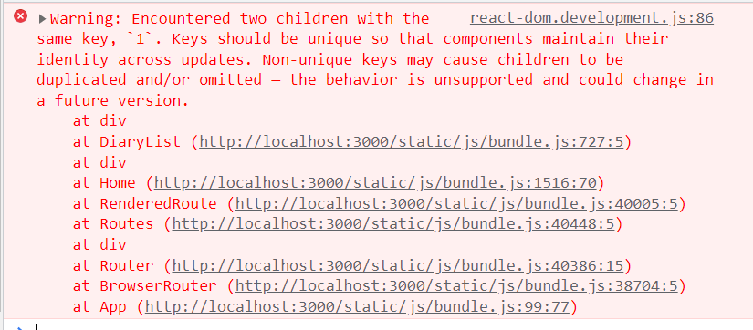
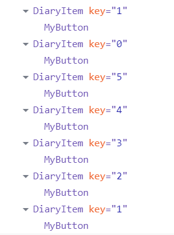
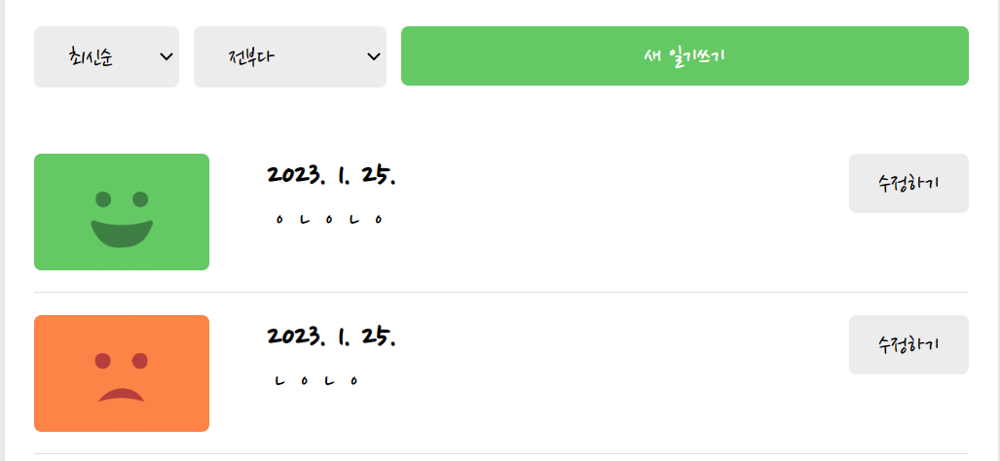

# 흔히 발생하는 버그 수정하기


1. key가 겹치는 버그 발생
   
   새로 글 두개를 생성했을  때, 생성된 컴포넌트의 key가 동일하여 겹치는문제가 발생했다.  
   
   

    

문제의 원인은 id의 초깃값으로 0을 주기 때문이다.그래서 그 값을 6으로 수정하면 된다.

```javascript
// App.js
// 수정 전
const dataId = useRef(0);

// 수정 후
const dataId = useRef(6);
```

2.  날짜를 31일로 설정했을 때, 데이터가 렌더링되지 않는 현상이 발생했다.
   
   
   
   원인은 lastDay의 값을 설정할 때, 23시, 59분, 59초도 포함시키지 않아서 이다.
   
   ```javascript
   // Home.js
   
   // 수정 후
   const lastDay = new Date(
     curDate.getFullYear(),
     curDate.getMonth() + 1,
     0,
     23,
     59,
     59
   ).getTime();
   
   ```
   
   
