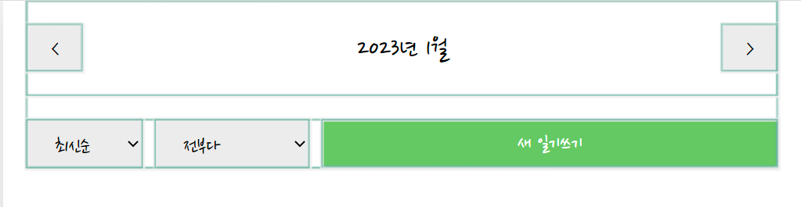
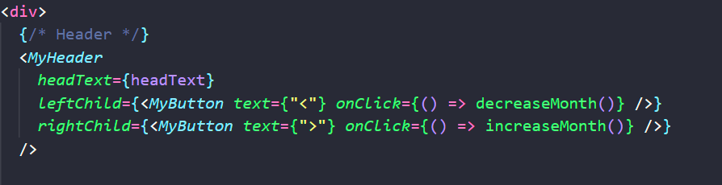
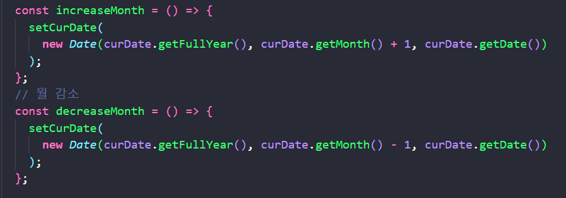
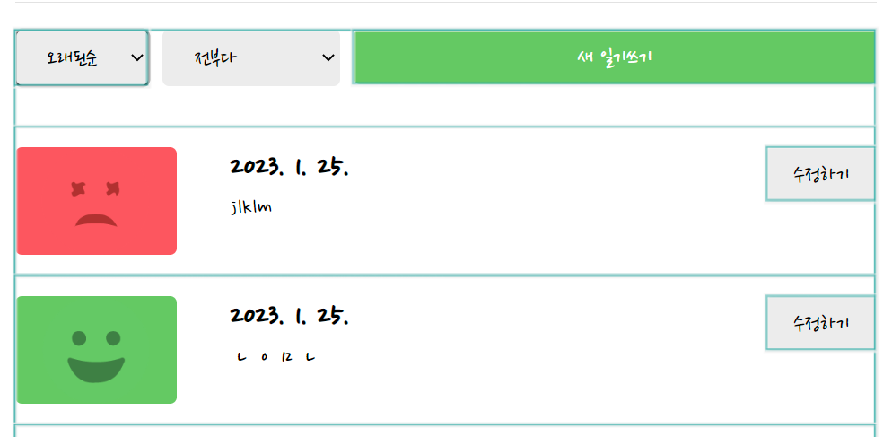
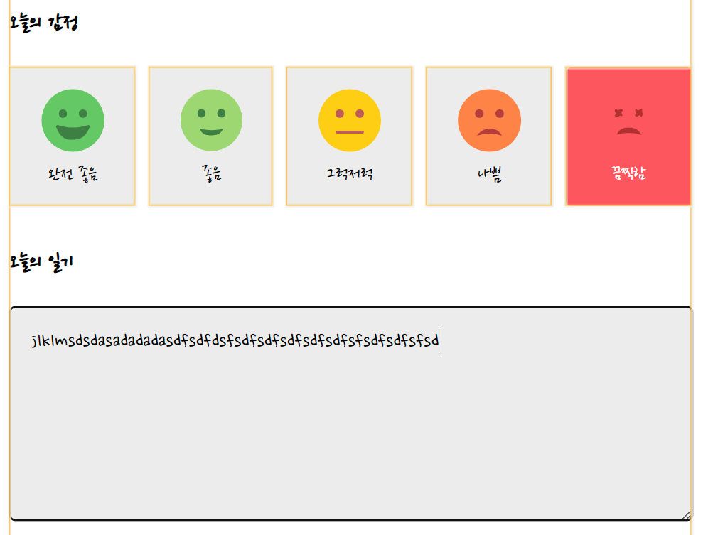
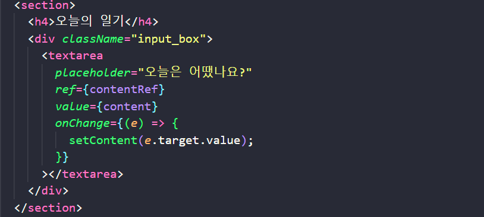
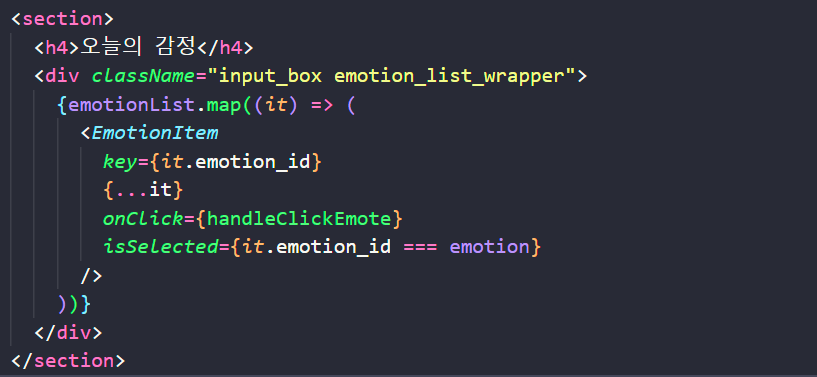
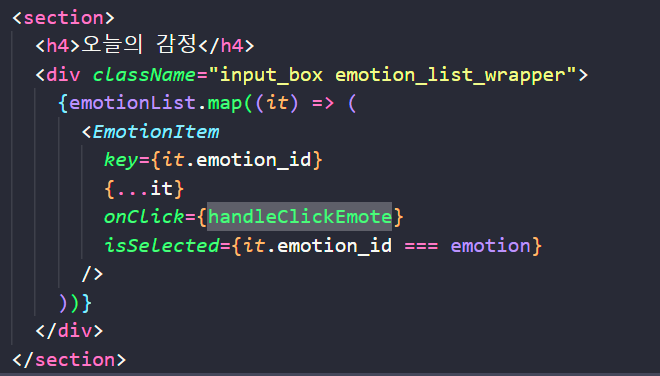

# 프로젝트 최적화


먼저 어떤 부분에서 자원이 낭비되고 있는지를 분석할 필요가 있다.

- 정적 분석: 코드만 읽어서 어떤 부분에서 최적화가 필요한지를 파악.

- 동적 분석: 다른 도구를 빌려(개발자 도구) 직접 확인하면서 최적화가 필요한 부분을 파악
  
  - `highlight updates when components render` 기능 사용


1. 날짜를 변경하는 버튼 클릭시 정렬과 필터링하는 부분은 따로 렌더링 될 필요가 없음.
   
   
   
   
   
   - 코드 분석
     
     먼저 `MyHeader` 부분의 `leftChild`와 `rightChild` 부분에 있는 버튼을 클릭하기 때문에, 해당 버튼 클릭시 onClick으로 전달된 `decreaseMonth`와 `increaseMonth`가 실행됨
     
     해당 함수를 살펴보면, setCurDate가 실행되면서 curDate 값이 바뀌는 것을 알 수 있음
     
     
     
     `curDate`의 값이 바뀌면, `Home`컴포넌트가 리렌더되고, 자식 컴포넌트인 `DiaryList` 컴포넌트도 리렌더링되고, 그 자식 컴포넌트인 `ControlMenu`도 리렌더링되기 때문에 정렬과 필터 부분도 리렌더링되는 것이다. 
   
   - 최적화 적용
     
     그렇기 때문에 `React.memo`를 통해 해당 컴포넌트가 리렌더링되지 않도록 최적화해주자. (**전달받는 prop이 값이 변경되지 않으면 , 렌더링이 일어나지 않게** 메모이제이션해줌으로써 성능을 최적화함.)
     
     ```javascript
     const ControlMenu = React.memo(({ value, onChange, optionList }) => {
       return (
         <select
           className="ControlMenu"
           value={value}
           onChange={(e) => onChange(e.target.value)}
         >
           {optionList.map((it, idx) => (
             <option key={idx} value={it.value}>
               {it.name}
             </option>
           ))}
         </select>
       );
     });
     ```
     
     

2.  DiaryItem 컴포넌트가 내부의 값이 변화하지 않았는데도, 정렬이나 필터링을 했을때 계속 렌더링되는 현상.
   
   
   
   ```javascript
   export default React.memo(DiaryItem);
   ```

3. 오늘의 일기 부분에 입력했을 때, 오늘의 감정도 리렌더링되는 현상 발생.
   
   
   
   - 코드 분석
     
     `content`의 상태가 계속 변하면서 `DiaryEditor` 컴포넌트가 리렌더링되고, 그 하위 컴포넌트인 `EmotionItem`도 리렌더링됨.
     
     
   
   - 코드 수정
     
     먼저 React.memo로 EmotionItem을 감싸준다. 
     
     ```javascript
     // EmotionItem.js
     import React from "react";
     ...
     export default React.memo(EmotionItem);
     ```
     
     그런데, 이렇게 해도 리렌더링이 계속 발생하는 것을 확인할 수 있다. 이는 props로 전달받는 인자 중에 onClick 함수가 있기 때문에 별도의 처리를 해주어야한다.
     
     
     
     해당 함수를 `useCallback`으로 감싸준다.
     
     ```javascript
     const handleClickEmote = useCallback((emotion) => {
       setEmotion(emotion);
     }, []);
     ```


    
