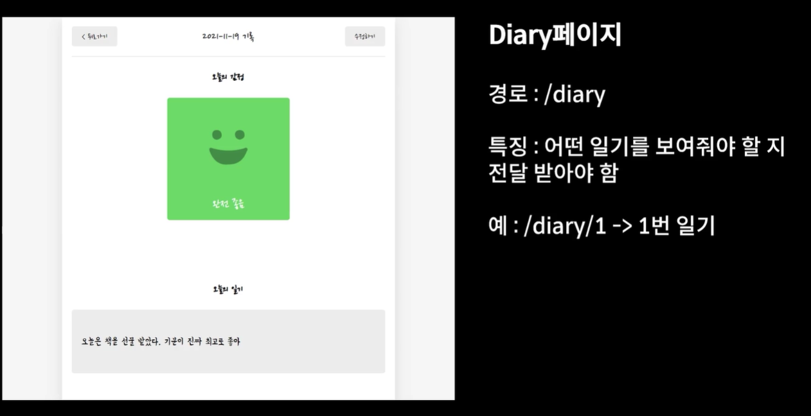
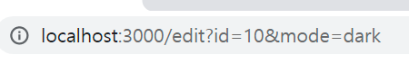
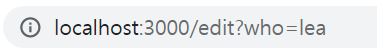

# 페이지 라우팅 2 - React Router 응용

**keyword**: `Router`, `React Router`, `Path Variable`, `Query String`, `Page Moving`, `useParams`, `useSearchParams`,`useNavigate`


## Path Variable



일기 상세페이지로 이동시, 어떤 일기를 보여줄지에 대한 정보가 필요하다. 그래서 그 정보를 경로에 담아서 전달하게 된다. 이처럼, 경로에 담아 전달되는 변수를 `path variable` 이라 일컫는다.

### useParams

`React Custom Hooks` 중 하나로, 전달되는 `path variable`의 값을 받을 수 있다. 

먼저, path variable을 전달하기 위해 `App` 컴포넌트에서 `Diary` 컴포넌트로의 이동을 위한 `Route` 컴포넌트의 `path` 값에 `id` 라는 path variable을 전달한다. `:`를 앞에 붙여주면 path variable을 의미하게 된다.

```javascript
import "./App.css";
import { BrowserRouter, Route, Routes } from "react-router-dom";
import Home from "./pages/Home";
import Edit from "./pages/Edit";
import New from "./pages/New";
import Diary from "./pages/Diary";
import RouteTest from "./components/RouteTest";

function App() {
  return (
    <BrowserRouter>
      <div className="App">
        <h2>App.js</h2>
        <Routes>
          <Route path="/" element={<Home />} />
          <Route path="/new" element={<New />} />
          <Route path="/edit" element={<Edit />} />
          <Route path="/diary/:id" element={<Diary />} />
        </Routes>
        <RouteTest />
      </div>
    </BrowserRouter>
  );
}

export default App;
```

이후 해당 id값을 받아오기 위해 `useParams` 를 사용하여 구조분해할당으로 해당 값을 받아온다.

```javascript
// Diary.js
import { useParams } from "react-router-dom";

const Diary = () => {
  const { id } = useParams();
  return (
    <div>
      <h1>Diary</h1>
      <p>이곳은 일기 상세 페이지입니다.</p>
    </div>
  );
};

export default Diary;
```


## Query String

웹 페이지에 데이터를 전달하는 가장 간단한 방법.

> edit?id=10&mode=dark

`?` 뒤에 넘기고 싶은 데이터를 `key=value`로 작성하면 된다. 만약 전달하고 싶은 데이터가 여러 개라면 `&` 기호를 사용하여 여러 개를 넘길 수 있다. 이러한 데이터들은 page routing 하는 경로에 영향을 주지 않는다.

### useSearchParams

`React Custom Hooks` 중 하나로, 전달된 query string의 값을 쉽게 받아올 수 있다.

먼저, query string을 전달받을 컴포넌트에서 `useSeartchParams`를 import한다. 그 후 구조분해할당을 통해 `searchParams`와 `setSearchParams`값을 받아온다.  이때 변수명은 정해져있지 않고 바뀔 수 있기 때문에 원하는 명칭을 사용하면 된다. 그리고 전달한 `id`의 값을 `searchParams.get("id")`로 받아오면 되는데, get으로 받아오는 이유는 query String의 값이 제대로 전달되지 않았을 경우가 발생할 수 있기 때문에 이렇게 받아온다. 



만약 query string의 값을 변경하고 싶다면 setSearchParams를 사용하여 인자로 객체를 넘기면 된다.



```javascript
import { useSearchParams } from "react-router-dom";

// Edit.js
const Edit = () => {
  const [searchParams, setSearchParams] = useSearchParams();

  const id = searchParams.get("id");
  const mode = searchParams.get("mode");

  console.log(id, mode);
  return (
    <div>
      <h1>Edit</h1>
      <p>이곳은 일기 수정 페이지입니다.</p>
      <button onClick={() => setSearchParams({ who: "lea" })}>QS 바꾸기</button>
    </div>
  );
};

export default Edit;

```


## Page Moving

페이지를 이동할 수 있도록 도와주는 훅 한가지를 소개한다. 

### useNavigate

`React Custom Hooks` 중 하나로, 경로를 변경하고 싶을 때 사용할 수 있다.

먼저 `useNavigate`를 `react-router0-dom`으로 부터 import를 한 후, 원하는 곳에 `navigate()` 함수를 넣어주면 되는데, 인자로는 이동하고 싶은 경로를 넣어주면 된다. 만약, 뒤로가고 싶으면 인자값으로 `-1`을 전달해주면 된다.

```javascript
import { useNavigate } from "react-router-dom";

// Edit.js
const Edit = () => {
  const navigate = useNavigate();
  return (
    <div>
      <h1>Edit</h1>
      <p>이곳은 일기 수정 페이지입니다.</p>

      <button
        onClick={() => {
          navigate("/home");
        }}
      >
        Home으로 이동
      </button>
      <button
        onClick={() => {
          navigate(-1);
        }}
      >
        뒤로가기
      </button>
    </div>
  );
};

export default Edit;

```

이 기능은 로그인 안한 사용자가 로그인이 필요한 서비스에 접근할 때, 강제로 로그인 페이지로 이동시킬 때 사용할 수 있다.
