# 프로젝트 기초공사1

**keyword**: `폰트 세팅`, `레이아웃세팅`,`이미지 에셋 세팅`, `공통 컴포넌트 세팅`


## 폰트 세팅

[Google Web Fonts](https://fonts.google.com/)를 이용한 프로젝트에 사용되는 폰트 세팅하기 


1. 원하는 폰트에 들어가 select를 한다.

        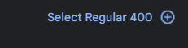

2. 원하는 폰트를 모두 다 선택하였다면 오른쪽 패널에서 `@import`를 선택한다.

        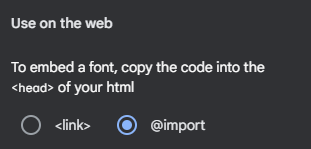

3. `@import`로 시작하는 코드를 긁어와 `App.css` 최상단에 붙여준다. (<style> 태그는 제외)

        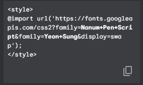

4. 원하는 폰트를 font-family로 불러와 사용하면 된다.

        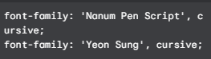    


실제로 App.css에 적용시킨 모습.

```css
/* App.css */
@import url("https://fonts.googleapis.com/css2?family=Nanum+Pen+Script&family=Yeon+Sung&display=swap");

.App {
  padding: 20px;
  font-family: "Nanum Pen Script", cursive;
  font-family: "Yeon Sung", cursive;
}

```


## 레이아웃 세팅

모든 페이지에 반영되는 레이아웃 세팅

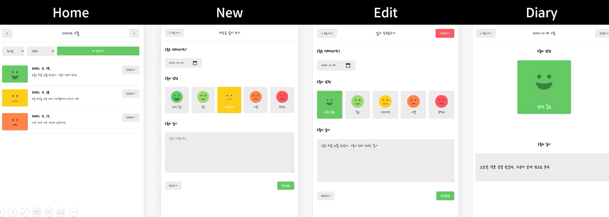

모든 페이지의 메인 콘텐츠는 흰색 바탕에 그림자가 있고 그 아래 바탕은 회색 등등의 기본적인 설정을 해준다.

```css
/* App.css */
@import url("https://fonts.googleapis.com/css2?family=Nanum+Pen+Script&family=Yeon+Sung&display=swap");

body {
  background-color: #f6f6f6;
  display: flex;
  justify-content: center;
  align-items: center;
  font-family: "Nanum Pen Script";
  min-height: 100vh;
  margin: 0;
}

@media (min-width: 650px) {
  .App {
    width: 640px;
  }
}
@media (max-width: 650px) {
  .App {
    width: 90vw;
  }
}

#root {
  background-color: white;
  box-shadow: rgba(100, 100, 111, 0.2) 0px 7px 29px 0px;
}

.App {
  min-height: 100vh;
  padding-left: 20px;
  padding-right: 20px;
}

```

 

## 이미지 에셋 세팅

감정 이미지들을 프로젝트에서 불러와 사용할 수 있는 환경 세팅

`public` 폴더 안에 `assets`라는 폴더를 만들고 그 안에 이미지들을 따로 저장한다.

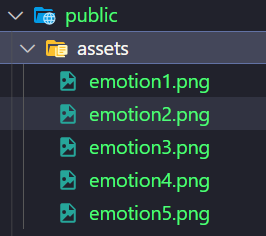

이 이미지를 사용하고 싶다면 `img` 태그의 `src` 부분에 {`process.env.PUBLIC_URL` + `퍼블릭 폴더 내 이미지의 주소` }로 작성하면 된다. 여기서 `process.env.PUBLIC_URL`은 현재 프로젝트 내 public 폴더의 위치를 의미한다.

```javascript
function App() {
  return (
    <BrowserRouter>
      <div className="App">
        <h2>App.js</h2>
        
        <Routes>
          <Route path="/" element={<Home />} />
          <Route path="/new" element={<New />} />
          <Route path="/edit" element={<Edit />} />
          <Route path="/diary/:id" element={<Diary />} />
        </Routes>
      </div>
    </BrowserRouter>
  );
}
```


## 공통 컴포넌트 세팅

모든 페이지에 공통으로 사용되는 버튼, 헤더 컴포넌트 세팅


#### 공통으로 사용되는 버튼

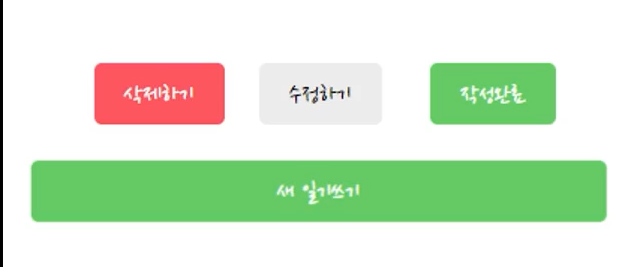

 `type`에 따라 버튼의 배경색, 글자색 등을 달리한다. 

`text`는 그 버튼 속의 어떠한 글자가 들어갈 것인지 정한다.

`onClick`은 버튼을 눌렀을 때 어떠한 함수가 실행될지를 정한다.

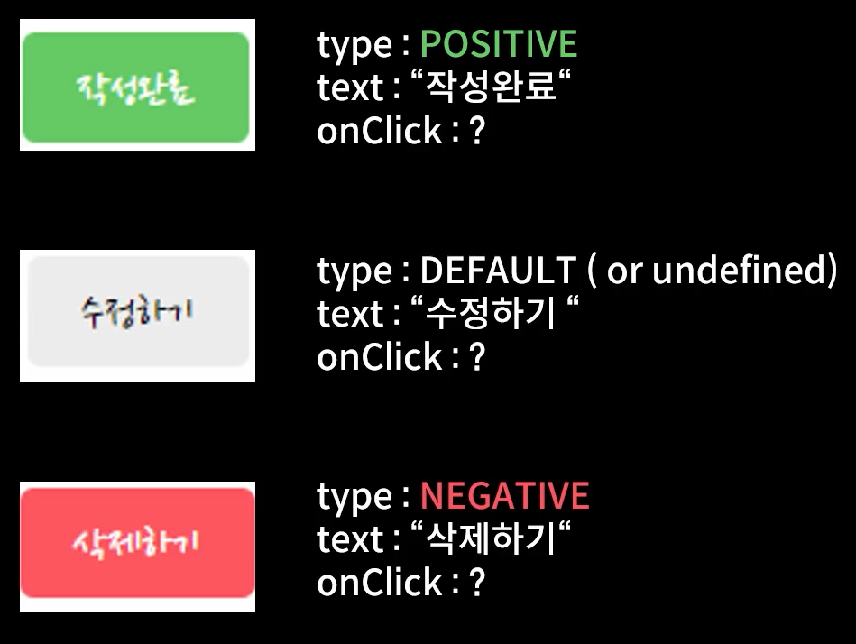

공통적인 버튼의 외관(`padding`, `font`, `border-radius` 등)은 `MyButton`이라는 공통 버튼 클래스로 정의하여 사용한다.  `type`에 따라 달라지는 외관은 `MyButton_{type}`의 클래스로 따로 정의하여 사용한다. 

```css
/* MyButton */
.MyButton {
  cursor: pointer;
  border: none;
  border-radius: 5px;
  padding: 10px 20px 10px 20px;
  font-size: 18px;
  white-space: nowrap;
  font-family: "Nanum Pen Script";
}
.MyButton_default {
  background-color: #ececec;
  color: black;
}
.MyButton_positive {
  background-color: #64c964;
  color: white;
}
.MyButton_negative {
  background-color: #fd565f;
  color: white;
}
```

혹시나하는 타입 입력 에러를 막고자, 

`defaultProps()`을 통해 `type`의 초기값을 설정하고 

`type`이 잘못 입력되었을 때, 모두 `default` 타입을 갖게하는 `btnType`을 따로 정의하여 사용한다.

```javascript
const MyButton = ({ text, type, onClick }) => {
  const btnType = ["positive", "negative"].includes(type) ? type : "default";
  return (
    <button
      className={["MyButton", `MyButton_${btnType}`].join(" ")}
      onClick={onClick}
    >
      {text}
    </button>
  );
};

MyButton.defaultProps = {
  type: "default",
};

export default MyButton;
efault MyButton;

```


#### 공통으로 사용되는 헤더

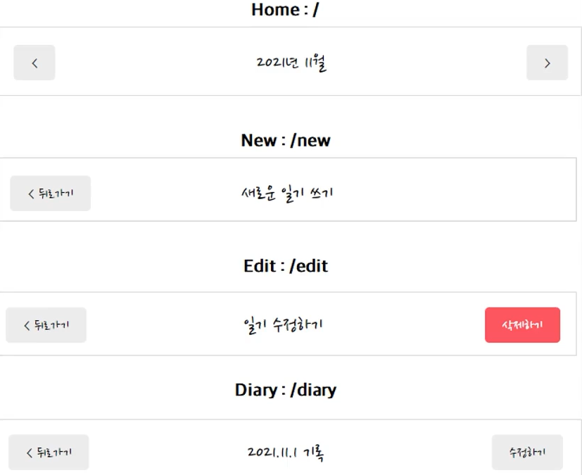


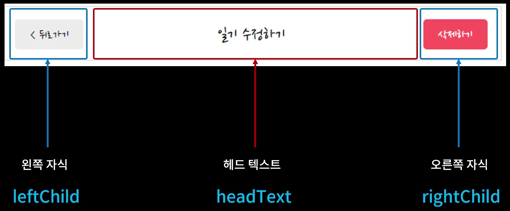

헤더에는 규칙이 존재하는데, 가운데에는 헤드 텍스트(`headText`)가 존재하고, 왼쪽 자식(`leftChild`)과 오른쪽 자식(`rightChild`)에는 버튼이 존재할 수도 있고 존재하지 않을 수도 있다.

먼저, `MyHeader` 컴포넌트를 만들어서 `headText`, `leftChild`, `rightChild`를 props로 전달받을 수 있도록 한다. 그리고 각각의 className을 지정하여 css를 적용할 수 있도록 한다.

```javascript
const MyHeader = ({ headText, leftChild, rightChild }) => {
  return (
    <header>
      <div className="head_btn_left">{leftChild}</div>
      <div className="head_text">{headText}</div>
      <div className="head_btn_right">{rightChild}</div>
    </header>
  );
};

export default MyHeader;

```

```css
/* HEADER */

header {
  padding-top: 20px;
  padding-bottom: 20px;

  display: flex;
  align-items: center;
  border-bottom: 1px solid #e2e2e2;
}

header > div {
  display: flex;
}

header .head_text {
  width: 50%;
  font-size: 25px;
  justify-content: center;
}

header .head_btn_left {
  width: 25%;
  justify-content: start;
}

header .head_btn_right {
  width: 25%;
  justify-content: end;
}
```

`App.js`에서 `MyHeader`를 불러오는데, `headerText`에는 넣고싶은 header 문구를, `leftChild`와 `rightChild`에는 버튼 컴포넌트를 props로 넣어준다. 

```javascript
function App() {
  return (
    <BrowserRouter>
      <div className="App">
        <MyHeader
          headText={"App"}
          leftChild={
            <MyButton text={"왼쪽 버튼"} onClick={() => alert("왼쪽 클릭")} />
          }
          rightChild={
            <MyButton
              text={"오른쪽 버튼"}
              onClick={() => alert("오른쪽 클릭")}
            />
          }
        />
        <h2>App.js</h2>
        <Routes>
          <Route path="/" element={<Home />} />
          <Route path="/new" element={<New />} />
          <Route path="/edit" element={<Edit />} />
          <Route path="/diary/:id" element={<Diary />} />
        </Routes>
      </div>
    </BrowserRouter>
  );
}
```

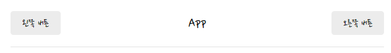

완성된 모습이다.
