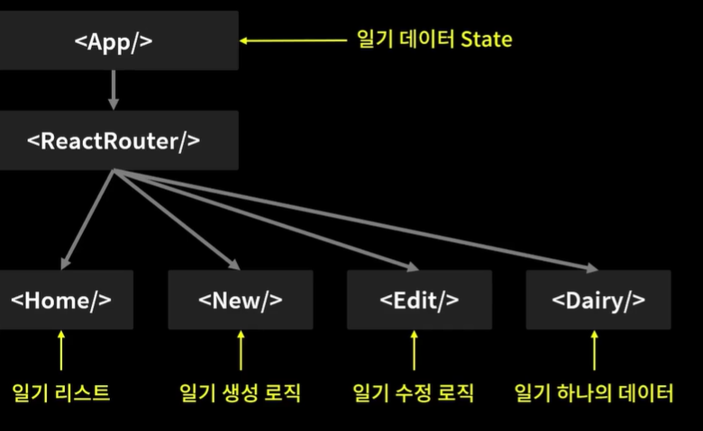

# 

# 프로젝트 기초공사 2

**keyword**: `상태관리 세팅`, `State Context 세팅`, `Dispatch Context 세팅`

## 상태관리 세팅

프로젝트 전반적으로 사용될 일기 데이터 State 관리 로직 작성하기



### useReducer를 통한 data 관리하기

먼저 `data`의 상태를 관리하기 위해 `useReducer`를 사용한다. 

```javascript
const [data, dispatch] = useReducer(reducer, []);
```

그리고 `reducer`를 별도로 정의한다.

```javascript
const reducer = (state, action) => {
  let newState = [];
  switch (action.type) {
    case "INIT": {
      return action.data;
    }
    case "CREATE": {
      const newItem = {
        ...action.data,
      };
      newState = [newItem, ...state];
      break;
    }
    case "REMOVE": {
      newState = state.filter((it) => it.id !== action.targetId);
      break;
    }
    case "EDIT": {
      newState = state.map((it) =>
        it.id === action.data.id ? { ...action.data } : it
      );
      break;
    }
    default:
      return state;
  }
  return newState;
};
```

그리고 이러한 상태관리를 사용할 함수들, `onCreate`, `onUpdate`, `onEdit`을 정의한다. 아까 작성했던 `reducer`에 변수를 전달하기 위해 `dispatch`함수를 선언하고, 알맞은 `type`과 `data` 등을 전달한다.

```javascript
const dataId = useRef(0);
// CREATE
const onCreate = (date, content, emotion) => {
  dispatch({
    type: "CREATE",
    data: {
      id: dataId.current,
      date: new Date(date).getTime(),
      content,
      emotion,
    },
  });
  dataId.current += 1;
};

// REMOVE
const onRemove = (targetId) => {
  dispatch({ type: "REMOVE", targetId });
};

// EDIT
const onEdit = (targetId, date, content, emotion) => {
  dispatch({
    type: "EDIT",
    data: {
      id: targetId,
      date: new Date(date).getTime(),
      content,
      emotion,
    },
  });
};
```

## 프로젝트 State Context 세팅

일기 데이터 State를 공급할 Context를 생성하고 Provider로 공급하기

먼저 `data`를 공급할 context인 `DiaryStateContext`를 정의한다.

```javascript
export const DiaryStateContext = React.createContext();
```

그러고 나서, 공급을 위해 `DiaryStateContext`로 컴포넌트들을 감싼다. 그리고 `value`로 `data`을 전달한다.

```javascript
<DiaryStateContext.Provider value={data}>
  <BrowserRouter>
    <div className="App">
      <Routes>
        <Route path="/" element={<Home />} />
        <Route path="/new" element={<New />} />
        <Route path="/edit" element={<Edit />} />
        <Route path="/diary/:id" element={<Diary />} />
      </Routes>
    </div>
  </BrowserRouter>
</DiaryStateContext.Provider>
```

## 프로젝트 Dispatch Context 세팅

일기 데이터 State의 Dispatch 함수들을 공급할 Context를 생성하고 Provider로 공급하기

{`onCreate`, `onRemove`, `onEdit`}과 같은 `dispatch`를 공급할 context인 `DiaryDispatchContext`를 정의한다.

```javascript
export const DiaryDispatchContext = React.createContext()
```

그러고 나서, 공급을 위해 `DiaryDispatchContext`로 컴포넌트들을 감싼다. 그리고 `value`로 {`onCreate`, `onRemove`, `onEdit`}를 전달한다.

```javascript
<DiaryStateContext.Provider value={data}>
  <DiaryDispatchContext.Provider value={{ onCreate, onEdit, onRemove }}>
    <BrowserRouter>
      <div className="App">
        <Routes>
          <Route path="/" element={<Home />} />
          <Route path="/new" element={<New />} />
          <Route path="/edit" element={<Edit />} />
          <Route path="/diary/:id" element={<Diary />} />
        </Routes>
      </div>
    </BrowserRouter>
  </DiaryDispatchContext.Provider>
</DiaryStateContext.Provider>
```
