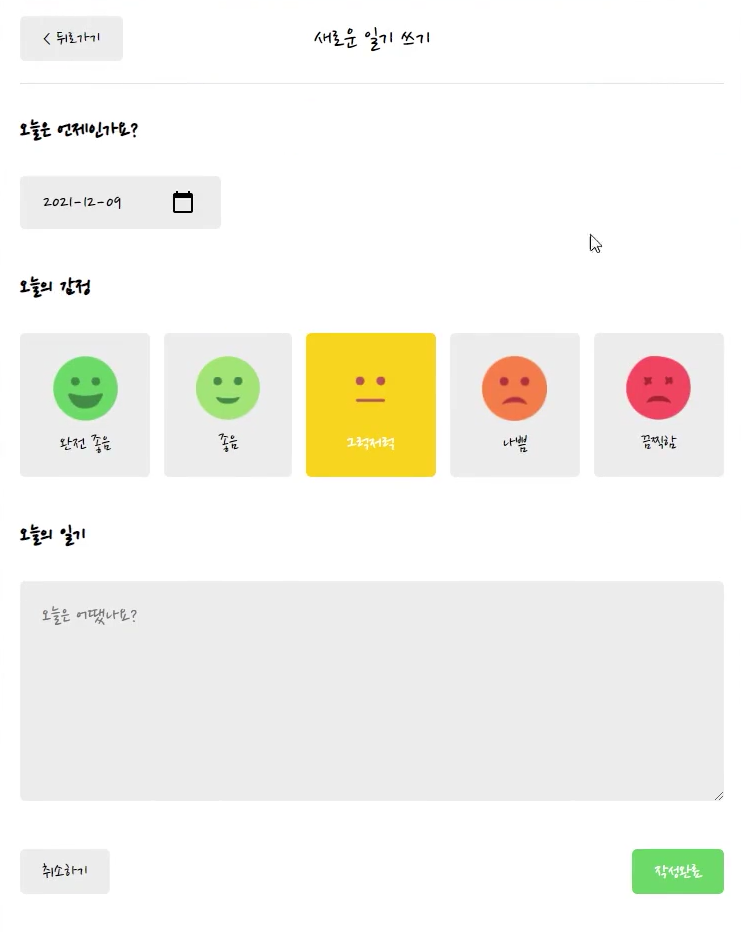
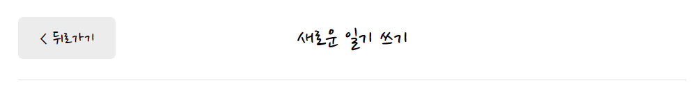
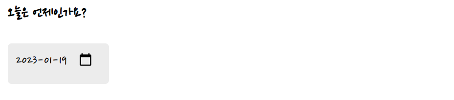
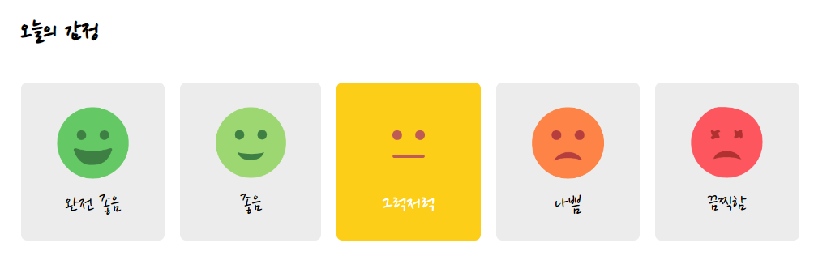

# New 구현하기



New의 경우, 이후 Edit 부분과 컴포넌트 구성이 동일하기 때문에 `DiaryEditor`라는 컴포넌트를 만들어 import 하는 방식을 채택했다.

## DiaryEditor 컴포넌트 만들기

`DiaryEditor` 컴포넌트를 먼저 만들어준다.

```javascript
const DiaryEditor = () => {
    return <div></div>
}
export default DiaryEditor
```

## 헤더 만들기



이전에 만들어둔 `MyHeader` 컴포넌트를 활용할 것이다. headText로 "새로운 일기 쓰기"를 넣어주고 leftChild에는 `MyButton` 컴포넌트를 넣어준다. onClick 이벤트로 이전 페이지 이동을 넣어 주기 위해 `useNavigate`를 사용하여 구현한다.

```javascript
import { useNavigate } from "react-router-dom";
import MyHeader from "./MyHeader";
import MyButton from "./MyButton";
const DiaryEditor = () => {
  const navigate = useNavigate();
  return (
    <div className="DiaryEditor">
      <MyHeader
        headText={"새로운 일기 쓰기"}
        leftChild={
          <MyButton text={"< 뒤로가기"} onClick={() => navigate(-1)} />
        }
      />
    </div>
  );
};

export default DiaryEditor;
```

## 하위 섹션 만들기

그 다음 하위 섹션들을 만들어 주어야 한다. 

### 오늘은 언제인가요? 구현



선택한 날짜 데이터를 `date`라는 state로 설정한다. 날짜를 입력받을 input 태그를 만들고 타입을 `date`로 설정한다. value를 `date`로, onChange에는 setDate를 넣어 date 값을 변경할 수 있도록 한다.  

```javascript
import { useState } from "react";
import { useNavigate } from "react-router-dom";
import MyHeader from "./MyHeader";
import MyButton from "./MyButton";
const getStringDate = (date) => {
  return date.toISOString().slice(0, 10);
};
const DiaryEditor = () => {
  const navigate = useNavigate();
  const [date, setDate] = useState(getStringDate(new Date()));
  return (
    <div className="DiaryEditor">
      <MyHeader
        headText={"새로운 일기 쓰기"}
        leftChild={
          <MyButton text={"< 뒤로가기"} onClick={() => navigate(-1)} />
        }
      />
      <div>
        <section>
          <h4>오늘은 언제인가요?</h4>
          <div className="input_box">
            <input
              className="input_date"
              type="date"
              value={date}
              onChange={(e) => setDate(e.target.value)}
            />
          </div>
        </section>
      </div>
    </div>
  );
};
export default DiaryEditor;
```

### 오늘의 감정 구현



1. 먼저 `emotionList`를 만들어서 id, img경로, 문구를 저장한다.
   
   ```javascript
   const emotionList = [
     {
       emotion_id: 1,
       emotion_img: process.env.PUBLIC_URL + "/assets/emotion1.png",
       emotion_descript: "완전 좋음",
     },
     {
       emotion_id: 2,
       emotion_img: process.env.PUBLIC_URL + "/assets/emotion2.png",
       emotion_descript: "좋음",
     },
     {
       emotion_id: 3,
       emotion_img: process.env.PUBLIC_URL + "/assets/emotion3.png",
       emotion_descript: "그럭저럭",
     },
     {
       emotion_id: 4,
       emotion_img: process.env.PUBLIC_URL + "/assets/emotion4.png",
       emotion_descript: "나쁨",
     },
     {
       emotion_id: 5,
       emotion_img: process.env.PUBLIC_URL + "/assets/emotion5.png",
       emotion_descript: "끔찍함",
     },
   ];
   ```

2. 이렇게 만든 emotionList의 각각을 `EmotionItem`컴포넌트로 분리시킨다.
   
   key값으로는 id, 이외의 값들은 모두 spread연산자를 이용해 전달한다.  
   
   ```javascript
   <section>
     <h4>오늘의 감정</h4>
     <div className="input_box emotion_list_wrapper">
       {emotionList.map((it) => (
         <EmotionItem
           key={it.emotion_id}
           {...it}
         />
       ))}
     </div>
   </section>
   ```
   
   ```javascript
   const EmotionItem = ({
     emotion_id,
     emotion_img,
     emotion_descript,
   }) => {
     return (
       <div className="EmotionItem">
         
         <span>{emotion_descript}</span>
       </div>
     );
   };
   
   export default EmotionItem;
   
   ```

3. 선택한 감정을 `emotion`으로 상태관리해준다.
   
   먼저 `useState`를 이용해 `emotion`과 `setEmotion`을 만든다.
   
   ```javascript
   // DiaryEditor.js
   const [emotion, setEmotion] = useState(3);
   ```
   
   각각의 감정 컴포넌트를 클릭했을 때 일어날 `onClick` 이벤트를 `handelClickEmote`라고 정의하고 이를 전달한다.
   
   ```javascript
   // DiaryEditor.js
   const handleClickEmote = (emotion) => {
       setEmotion(emotion);
     };
     
   return <div>
       ...
       <section>
         <h4>오늘의 감정</h4>
         <div className="input_box emotion_list_wrapper">
           {emotionList.map((it) => (
             <EmotionItem
               key={it.emotion_id}
               {...it}
               onClick={handleClickEmote}
             />
           ))}
         </div>
       </section>
     </div>
   ```
   
   ```javascript
   const EmotionItem = ({
     emotion_id,
     emotion_img,
     emotion_descript,
     onClick,
   }) => {
     return (
       <div
         className="EmotionItem"
         onClick={() => onClick(emotion_id)}
       >
         
         <span>{emotion_descript}</span>
       </div>
     );
   };
   
   export default EmotionItem;
   
   
   ```

4. 감정을 선택할 때마다 배경색이 바뀔 수 있도록 `isSelected` 를 props로 전달한다.
   
   감정이 선택될때 `emotion`의 값이 변화하게 되는데 그때마다 해당 감정의 `isSelected` 값을 true로 바뀌도록 적용시킨다.
   
   ```javascript
   <section>
     <h4>오늘의 감정</h4>
     <div className="input_box emotion_list_wrapper">
       {emotionList.map((it) => (
         <EmotionItem
           key={it.emotion_id}
           {...it}
           onClick={handleClickEmote}
           isSelected={it.emotion_id === emotion}
         />
       ))}
     </div>
   </section>
   ```
   
   그리고 선택된 감정에 따라 다른 css가 적용될 수 있도록, isSelected 값이 true일 때 특정 class를 적용시킨다.
   
   ```javascript
   const EmotionItem = ({
     emotion_id,
     emotion_img,
     emotion_descript,
     onClick,
     isSelected,
   }) => {
     return (
       <div
         className={[
           "EmotionItem",
           isSelected ? `EmotionItem_on_${emotion_id}` : "EmotionItem_off",
         ].join(" ")}
         onClick={() => onClick(emotion_id)}
       >
         
         <span>{emotion_descript}</span>
       </div>
     );
   };
   
   export default EmotionItem;
   
   ```

### 오늘의 일기 구현

1. 먼저 글을 작성하기 위한 textarea를 만들어 준다.
   
   ```javascript
   <section>
     <h4>오늘의 일기</h4>
     <div className="input_box">
       <textarea></textarea>
     </div>
   </section>
   ```

2. 작성된 글을 상태관리하기 위해, `content`와 `setContent`를 value와 onClick에 할당해준다.
   
   ```javascript
   const [content, setContent] = useState("");
   return <div>
       ...
       <section>
         <h4>오늘의 일기</h4>
         <div className="input_box">
           <textarea
             value={content}
             onChange={(e) => {
               setContent(e.target.value);
             }}
           ></textarea>
         </div>
       </section>
   </div>
   ```

### 하단의 버튼 구현

1. 취소하기 버튼과 작성완료 버튼을 `MyButton` 컴포넌트를 활용하여 만든다.
   
   취소하기 버튼에는 이전에 만들어두었던 navigate를 활용하여 뒤로가기를 구현한다.
   
   ```javascript
   const DiaryEditor = () => {
     return (
       <div className="DiaryEditor">
         <div>
           <section>
             <div className="control_box">
               <MyButton text={"취소하기"} onClick={() => navigate(-1)}></MyButton>
               <MyButton
                 text={"작성완료"}
                 type={"positive"}}
               ></MyButton>
             </div>
           </section>
         </div>
       </div>
     );
   };
   
   export default DiaryEditor;
   
   
   ```

2. 작성완료된 글을 저장하기 위해 onClick 이벤트인 `handleSubmit`을 만든다.
   
   글이 다 작성되지 않았을 때, focus를 주기 위해 useRef를 사용하여 reference로 적용시켜둔다.
   
   ```javascript
    const contentRef = useRef();
     
     ...
     <section>
       <h4>오늘의 일기</h4>
       <div className="input_box">
         <textarea
           ref={contentRef}
           value={content}
           onChange={(e) => {
             setContent(e.target.value);
           }}
         ></textarea>
       </div>
     </section>
   ```
   
   ```javascript
   const handleSubmit = () => {
       if (content.length < 1) {
         contentRef.current.focus();
         return;
       }
     };
   ```
   
   이전에 만들어두었던 `DiaryDispatchContext`를 활용하여 onCreate함수를 불러와 글을 만들어낼 수 있도록 한다. 그리고 다시 `home`으로 돌아가게 한다. 단, 이때 home 페이지에서 뒤로가기 했을 때 다시 작성페이지로 못오도록 `replace: true` 로 설정해둔다.
   
   ```javascript
   const { onCreate } = useContext(DiaryDispatchContext);
   const handleSubmit = () => {
       if (content.length < 1) {
         contentRef.current.focus();
         return;
       }
       onCreate(date, content, emotion);
       navigate("/", { replace: true });
   };
   ...
   <section>
     <div className="control_box">
       <MyButton text={"취소하기"} onClick={() => navigate(-1)}></MyButton>
       <MyButton
         text={"작성완료"}
         type={"positive"}
         onClick={handleSubmit}
       ></MyButton>
     </div>
   </section>  
   ```
