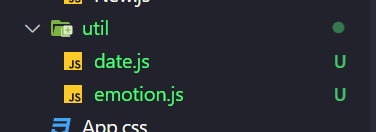

# Diary 구현하기


1. 조회하고자 하는 일기 데이터를 가져온다.
   
   일기가 없는 경우에는 홈으로 돌아갈 수 있도록 구현하고,
   
   일기가 있다면 setData를 통해 data에 일기를 저장한다.
   
   ```javascript
   // Diary.js
   import { useNavigate, useParams } from "react-router-dom";
   import { DiaryStateContext } from "../App";
   import { useContext, useEffect, useState } from "react";
   
   const Diary = () => {
     const { id } = useParams();
     const navigate = useNavigate();
     const diaryList = useContext(DiaryStateContext);
     const [data, setData] = useState();
     useEffect(() => {
       if (diaryList.length >= 1) {
         const targetDiary = diaryList.find(
           (it) => parseInt(it.id) === parseInt(id)
         );
   
         if (targetDiary) {
           setData(targetDiary);
         } else {
           alert("없는 일기입니다.");
           navigate("/", { replace: true });
         }
       }
     }, [id, diaryList]);
     return (
       <div>
         <h1>Diary</h1>
         <p>이곳은 일기 상세 페이지입니다.</p>
       </div>
     );
   };
   
   export default Diary;
   
   ```


2. 데이터가 로딩중일 때 처리하기
   
   data가 없을 때 로딩 중입니다를 띄우고, 있을 때 일기 데이터를 보여줄 수 있도록 한다.
   
   ```javascript
     if (!data) {
       return <div className="DiaryPage">로딩중입니다...</div>;
     } else {
       return (
         <div className="DiaryPage">
           <h1>Diary</h1>
           <p>이곳은 일기 상세 페이지입니다.</p>
         </div>
       );
     }
   ```

3. 헤더 만들기
   
   `2023-01-25의 기록` 이라는 형태로 헤더 문구를 넣기 위해 getStringDate 함수를 사용해야한다. 이 함수는 DiaryEditor에서 이미 사용되고 있었기 때문에 해당 함수를 따로 관리할 필요가 있다!! 
   
   먼저 `src` 하위에 `util`이라는 폴더를 만든다. 폴더 내부에 `date.js`라는 파일을 만들고 해당 파일에서 함수를 `export`한다.
   
   ```javascript
   export const getStringDate = (date) => {
     return date.toISOString().slice(0, 10);
   };
   ```
   
   DiaryEditor와 Diary 컴포넌트에서 해당 함수를 불러온다
   
   ```javascript
   import { getStringDate } from "../util/date";
   ```
   
   불러온 함수를 이용해서 headText를 전달하고 다른 props도 전달한다.
   
   ```javascript
   return (
     <div className="DiaryPage">
       <MyHeader
         headText={`${getStringDate(new Date(data.date))} 기록`}
         leftChild={
           <MyButton text={"< 뒤로가기"} onClick={() => navigate(-1)} />
         }
         rightChild={
           <MyButton
             text={"수정하기"}
             onClick={() => navigate(`/edit/${id}`)}
           />
         }
       />
       <h1>Diary</h1>
       <p>이곳은 일기 상세 페이지입니다.</p>
     </div>
   );
   ```

4. 오늘의 일기 파트 구현하기
   
   DiaryEditor에서 사용했던 emotionList를 똑같이 사용하기 위해 util/emotion으로 따로 파일을 분리한 뒤 사용한다.
   
   
   
   ```javascript
   export const emotionList = [
     {
       emotion_id: 1,
       emotion_img: process.env.PUBLIC_URL + "/assets/emotion1.png",
       emotion_descript: "완전 좋음",
     },
     {
       emotion_id: 2,
       emotion_img: process.env.PUBLIC_URL + "/assets/emotion2.png",
       emotion_descript: "좋음",
     },
     {
       emotion_id: 3,
       emotion_img: process.env.PUBLIC_URL + "/assets/emotion3.png",
       emotion_descript: "그럭저럭",
     },
     {
       emotion_id: 4,
       emotion_img: process.env.PUBLIC_URL + "/assets/emotion4.png",
       emotion_descript: "나쁨",
     },
     {
       emotion_id: 5,
       emotion_img: process.env.PUBLIC_URL + "/assets/emotion5.png",
       emotion_descript: "끔찍함",
     },
   ];
   
   ```
   
   ```javascript
   import { emotionList } from "../util/emotion";
   ```
   
   받아온 emotionList에서 원하는 감정 정보를 꺼낸다.
   
   ```javascript
   const curEmotionData = emotionList.find(
         (it) => parseInt(it.emotion_id) === parseInt(data.emotion)
       );
   ```
   
   curEmotionData를 활용하여 오늘의 감정 파트를 구현한다.
   
   ```javascript
   <article>
     <section>
       <h4>오늘의 감정</h4>
       <div className="diary_img_wrapper">
         
         <div className="emotion_descript">
           {curEmotionData.emotion_descript}
         </div>
       </div>
     </section>
   </article>
   ```

5. 오늘의 일기 파트 구현하기
   
   ```javascript
   <section>
     <h4>오늘의 일기</h4>
     <div className="diary_content_wrapper">
       <p>{data.content}</p>
     </div>
   </section>
   ```
